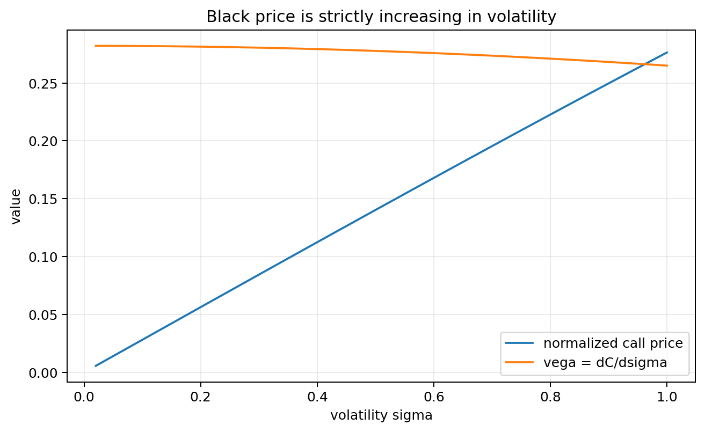
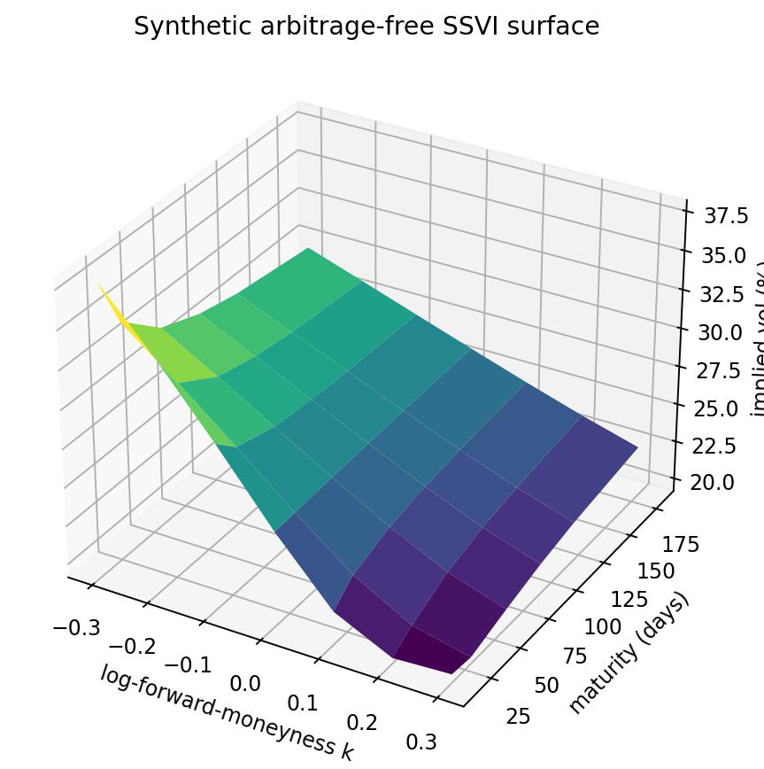
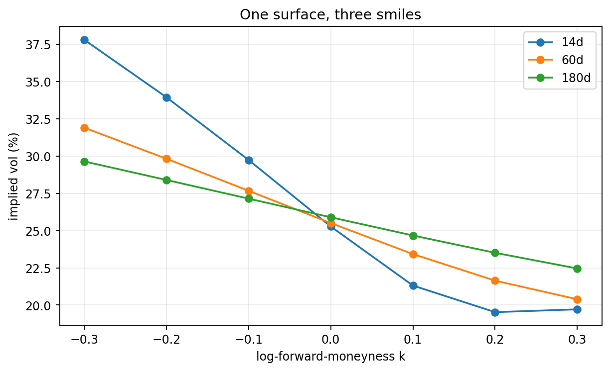
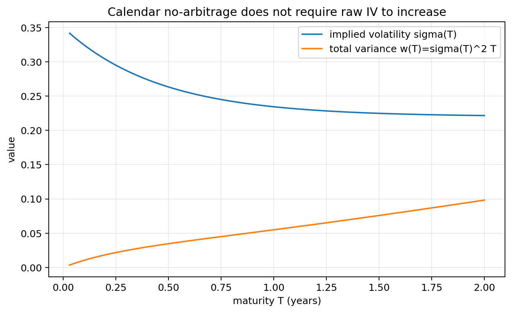
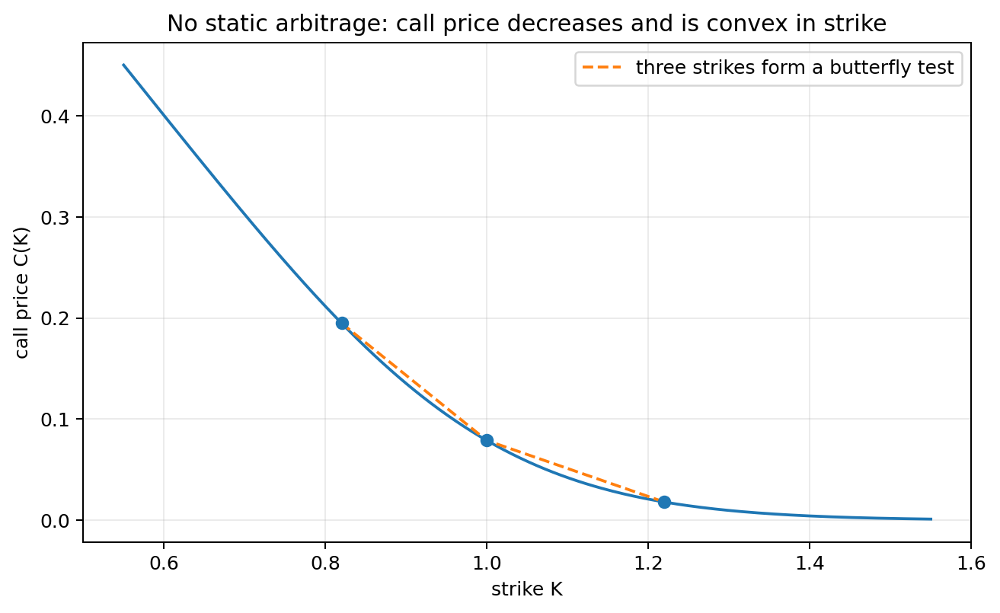
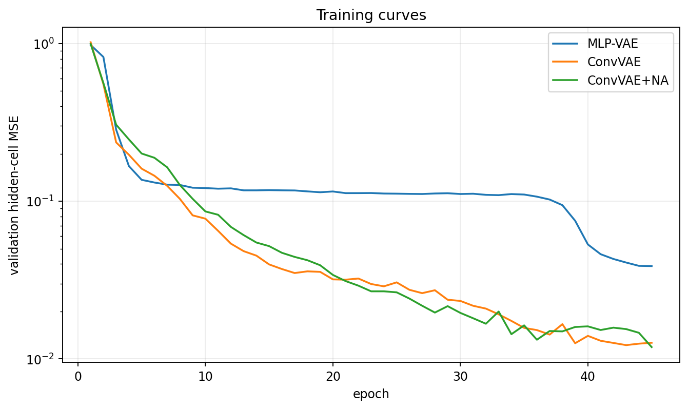
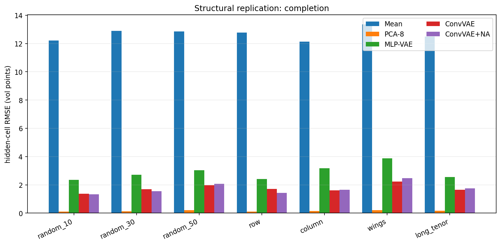
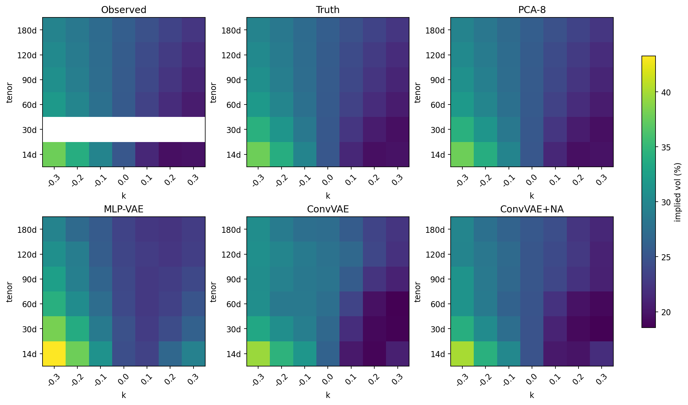
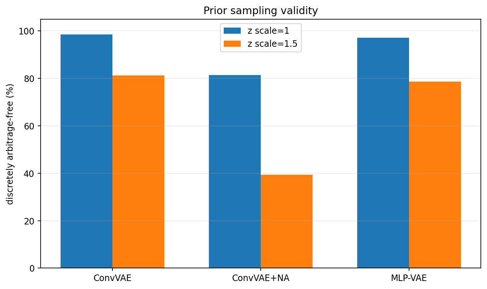
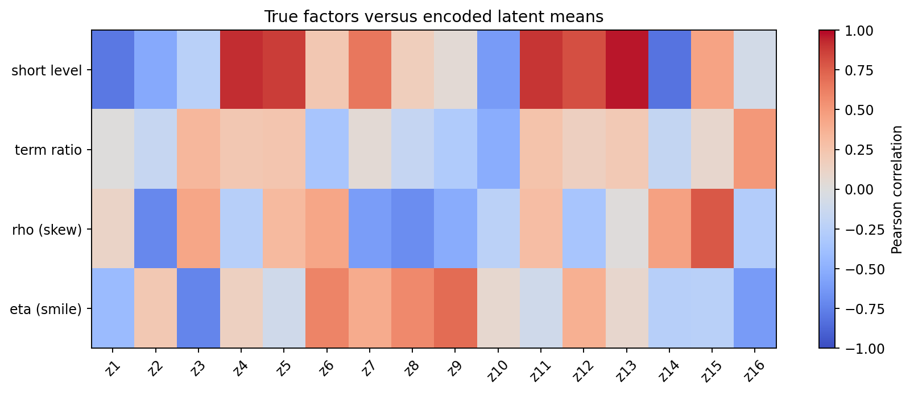

<div class="callout success">
<strong>这份报告做了三件彼此分开的事。</strong>第一部分从期权价格开始，逐步推导什么是 implied volatility surface，以及 static no-arbitrage 到底限制什么；第二部分从 latent-variable model 开始推导 VAE 的 ELBO、Gaussian KL 与 reparameterization；第三部分审计 2021–2026 年核心 vol-surface VAE 文献，并给出一份实际运行过的结构复现实验。文中用 <span class="badge reported">论文报告</span>、<span class="badge executed">本次实跑</span> 和 <span class="badge audit">审计判断</span> 明确区分证据来源。
</div>

# 0. 先看结论：这个领域真正研究的是什么？

“用 VAE 做 volatility surface”并不是一个单一问题。至少有五种不同任务：

1. **压缩与表示**：把一个几十到几千维的曲面压成少量 latent factors；
2. **补全**：给定部分报价，恢复缺失的 strike/maturity 单元；
3. **无条件生成**：从随机数生成历史分布上合理的新曲面，用于 stress/scenario；
4. **条件生成或预测**：给定 VIX、spot return、过去若干日曲面等上下文，生成未来曲面分布；
5. **可控生成**：直接指定 level、skew、curvature、term structure，再生成与这些控制量一致的曲面。

它们的最优建模方式并不一样。一个在重建误差上很好的 VAE，不一定能从先验 $z\sim N(0,I)$ 生成好曲面；一个能补全随机缺失点的模型，不一定能外推整条期限；一个在离散网格上没有套利的输出，也不一定在网格之间没有套利。

<div class="metric-grid">
<div class="metric"><b>99.99579%</b><small>本次四因子 SSVI 数据中，PCA-8 的累计解释方差</small></div>
<div class="metric"><b>34.6%</b><small>本次随机隐藏 50% 时，ConvVAE 相对 MLP-VAE 的 RMSE 降幅</small></div>
<div class="metric"><b>90.8%</b><small>2026 latent-flow 论文报告的“全部静态无套利检查通过”比例</small></div>
</div>

本报告最重要的判断是：

- **先选表示，再选网络。** 直接输出 IV、输出 log-IV、输出 total variance、输出 SVI/SSVI/SDE 参数，决定了模型是否容易满足金融约束。
- **PCA 必须保留为强基线。** 曲面通常极低维；在光滑、参数化、低噪声数据上，PCA 可以轻易击败 VAE。
- **“训练数据无套利”不推出“生成样本无套利”。** 解码器在训练流形附近表现好，不代表高斯先验的尾部也落在可行域内。
- **重建约束不等于先验生成约束。** 本次实跑中，简单的 no-arbitrage penalty 把完整重建的通过率从 93.70% 提到 99.63%，却把标准先验采样的通过率从 98.61% 降到 81.44%。这是一个有用的负结果，而不是应该被隐藏的异常。
- **严格无套利最可靠的路线仍是 hard parameterization。** 例如让 VAE 生成一个本身 arbitrage-free 的 SDE/SSVI 参数，再由定价模型映射到曲面。
- **2026 年的前沿已经从“VAE 本身”转向“VAE 作为低维几何层”。** 在 latent space 上再训练 flow 或 diffusion，以修复 aggregate posterior 与简单高斯先验之间的错配。

## 0.1 建议阅读路线

- 只想理解概念：读第 2–4 节。
- 想选研究方向：读第 5–7 节，尤其比较 hard guarantee、soft penalty、repair 和 latent flow。
- 想动手：读第 8–9 节，并运行配套脚本。
- 想做论文：读第 10 节；其中“带约束的非线性动态 tensor factor model”与你之前考虑的方向直接相连。

# 1. 全文只保留这一组记号

| 记号 | 含义 |
|---|---|
| $S_t$ | 当前 underlying spot |
| $F$ | 到期对应的 forward price |
| $K$ | strike |
| $\tau$ | time to maturity，单位为年 |
| $k=\log(K/F)$ | log-forward-moneyness |
| $\sigma(k,\tau)$ | implied volatility |
| $w(k,\tau)=\sigma(k,\tau)^2\tau$ | total implied variance |
| $x$ | 展平后的整张曲面向量 |
| $z$ | VAE latent vector |
| $m$ | mask；1 表示已观测，0 表示缺失 |

除非专门讨论网络参数，编码器和解码器分别记为 $E$ 与 $D$。这样可以避免在金融记号、概率记号和神经网络记号之间反复换字母。

# 2. 什么是 volatility surface？

## 2.1 从一张期权报价反推出一个 implied volatility

考虑一只欧式 call。用 forward 形式写 Black–Scholes 价格：

$$
C(K,\tau;\sigma)
= D(\tau)\bigl[F\,N(d_1)-K\,N(d_2)\bigr],
$$

其中

$$
d_1=\frac{\log(F/K)+\tfrac12\sigma^2\tau}{\sigma\sqrt{\tau}},
\qquad
d_2=d_1-\sigma\sqrt{\tau}.
$$

这里 $D(\tau)$ 是 discount factor，$N$ 是标准正态分布函数。市场给出价格 $C_{\mathrm{mkt}}$ 后，implied volatility 定义为方程

$$
C(K,\tau;\sigma_{\mathrm{imp}})=C_{\mathrm{mkt}}
$$

的解。它不是“未来真实波动率的直接观测”，而是**把市场价格映射回 Black–Scholes 波动率坐标后得到的报价语言**。

### 为什么这个反解通常是唯一的？

关键是 vega 始终为正。利用恒等式 $F\phi(d_1)=K\phi(d_2)$，其中 $\phi$ 是标准正态密度，可逐步计算：

$$
\begin{aligned}
\frac{\partial C}{\partial \sigma}
&=D\left[F\phi(d_1)\frac{\partial d_1}{\partial\sigma}
-K\phi(d_2)\frac{\partial d_2}{\partial\sigma}\right]\\
&=DF\phi(d_1)
\left(\frac{\partial d_1}{\partial\sigma}
-\frac{\partial d_2}{\partial\sigma}\right)\\
&=DF\phi(d_1)\sqrt{\tau}>0.
\end{aligned}
$$

所以，只要市场价格位于无套利价格界内，$C(K,\tau;\sigma)$ 随 $\sigma$ 严格递增，数值求根就有唯一解。

<figure>

<figcaption>图 1　本报告自行生成。ATM call 价格随波动率严格上升，因此可从价格唯一反解 implied volatility。</figcaption>
</figure>

<div class="callout warning">
<strong>数值上的重要例外：</strong>深度 ITM/OTM、极短期限或接近无套利边界时，vega 很小。此时价格中很小的 bid–ask 或舍入误差会被反解放大成很大的 IV 误差。因此，构建曲面时不应把每个 raw IV 点等权处理。
</div>

## 2.2 从一个点到一条 smile，再到一张 surface

固定到期 $\tau$，让 strike 变化，得到 volatility smile 或 skew：

$$
k\longmapsto \sigma(k,\tau).
$$

再让 maturity 变化，得到二维函数：

$$
(k,\tau)\longmapsto \sigma(k,\tau).
$$

这就是 implied volatility surface。股票指数通常表现为负 skew：较低 strike 的 put wing IV 更高；不同资产类别的形状不同，FX 常用 delta quote，rates 常出现 swaption cube，crypto 的短端和 wings 可能更加陡峭。

<figure>

<figcaption>图 2　本次复现实验的一张 SSVI 合成曲面。横轴为 log-forward-moneyness，纵轴为期限，竖轴为 IV。</figcaption>
</figure>

<figure>

<figcaption>图 3　同一张曲面的三个 maturity slices。surface 可以理解为一族随期限平滑变化的 smiles。</figcaption>
</figure>

## 2.3 为什么最好用 $k=\log(K/F)$ 和 total variance？

直接使用 $K/S$ 有两个问题：spot 与 carry 变化会让同一个固定 strike 在不同日期的相对位置漂移；不同资产也难以比较。log-forward-moneyness

$$
k=\log(K/F)
$$

把 ATM-forward 固定在 $k=0$，并把左右翼变成相对稳定的坐标。

对期限方向，常用

$$
w(k,\tau)=\sigma(k,\tau)^2\tau.
$$

原因不是为了“换个写法”，而是 option price 直接由 total variance 进入：$d_1$ 与 $d_2$ 中出现的是 $\sigma\sqrt{\tau}=\sqrt{w}$。而且 calendar no-arbitrage 更自然地作用于 option price 或 total variance，而不是要求 raw IV 随期限上升。

<figure>

<figcaption>图 4　IV 可以随期限下降，同时 total variance 继续上升。把“无 calendar arbitrage”误写成 IV 单调递增，会施加错误约束。</figcaption>
</figure>

## 2.4 曲面上的四种直观变形

为了读懂 VAE latent space，先把常见形变分开：

- **level**：整张曲面同时上移或下移；
- **skew/slope**：左翼与右翼的相对高低变化；
- **curvature/smile**：两翼相对 ATM 的弯曲程度；
- **term structure**：短端与长端的相对变化。

PCA 往往能用前三到五个线性因子描述大部分历史变化。VAE 的动机不是“PCA 完全无效”，而是希望用一个**非线性、概率化、可采样**的低维流形描述曲面。

# 3. Static no-arbitrage：曲面究竟要满足什么？

## 3.1 从 call payoff 直接推导 strike 方向约束

风险中性定价写成

$$
C(K,\tau)=D(\tau)\,\mathbb E[(S_T-K)^+].
$$

对 $K$ 求一阶导：当 $S_T>K$ 时，payoff 对 strike 的导数为 $-1$，否则为 0。因此

$$
\frac{\partial C}{\partial K}
=-D(\tau)\,\mathbb P(S_T>K),
$$

从而

$$
-D(\tau)\le \frac{\partial C}{\partial K}\le 0.
$$

这同时给出两个事实：call price 必须随 strike 下降；相邻 strike 的 vertical-spread slope 不能小于 $-D$。

若 $S_T$ 有密度 $f_T$，再求一次导数：

$$
\frac{\partial^2 C}{\partial K^2}=D(\tau)f_T(K)\ge 0.
$$

因此 call price 必须关于 strike 凸。负的二阶导对应“负概率密度”，也是 butterfly arbitrage 的连续形式。

<figure>

<figcaption>图 5　固定期限时，call price 对 strike 必须递减且凸。三个相邻 strike 就构成一个离散 butterfly 检查。</figcaption>
</figure>

## 3.2 离散网格上怎么检查？

设同一期限的 strikes 为 $K_1<K_2<\cdots<K_n$，call prices 为 $C_i$。定义相邻斜率

$$
s_i=\frac{C_{i+1}-C_i}{K_{i+1}-K_i}.
$$

则一个简单的离散检查是

$$
-D\le s_i\le 0,
\qquad
s_{i+1}\ge s_i.
$$

前者检查 vertical spread，后者检查 convexity/butterfly。对 calendar spread，应比较同一 strike、相同现金流口径下的 undiscounted call value；后到期不应更便宜。

<div class="callout warning">
<strong>坐标陷阱：</strong>固定 $k=\log(K/F)$ 不总等于固定 strike，因为 forward 会随期限变化。许多机器学习论文在统一 forward-normalized grid 上检查 calendar 条件，这是一个实用离散代理，但不能不加说明地等同于所有实际合约上的严格 calendar no-arbitrage。
</div>

## 3.3 为什么有 bid–ask 和交易成本，仍然要求 surface admissible？

现实报价中确实可能出现无法在成本后套利的小违例。构建模型时仍追求 arbitrage-free，原因不是相信可以无摩擦连续对冲，而是：

1. surface 要在未报价的 continuum 上插值；小范围 noisy violation 可能被插值器放大；
2. negative density 会让数字期权、exotic payoff 或 risk-neutral distribution 失去意义；
3. Dupire local volatility 在简化情形下含有

$$
\sigma_{\mathrm{loc}}^2(K,T)
=\frac{\partial_T C(K,T)}{\tfrac12 K^2\partial_{KK}C(K,T)}.
$$

若分子或分母符号错误，local variance 会变成负数或爆炸；
4. Greeks、scenario P&amp;L 和 hedging 会对局部不光滑与曲率异常非常敏感；
5. 生成模型可一次产生数万张曲面，哪怕每张只有几个 cell 违例，也会污染 downstream simulation。

所以应区分：**market quotes 是否存在可执行套利**，与**一个作为定价输入的连续曲面是否经济可接受**。前者要考虑 bid–ask、深度、时延与交易成本；后者通常应该满足更干净的结构条件。

## 3.4 SVI/SSVI 为什么经常出现？

SVI 用少量参数描述一个 maturity slice 的 total variance；SSVI 进一步把各期限连接成 surface。它们的价值是可以把无限维的函数约束转成少量参数约束。Gatheral–Jacquier 给出的 SSVI 形式之一是

$$
w(k,\theta)=\frac{\theta}{2}
\left[1+\rho\varphi(\theta)k+
\sqrt{\bigl(\varphi(\theta)k+\rho\bigr)^2+1-\rho^2}
\right],
$$

其中 $\theta$ 是 ATM total variance。只要 $\theta(\tau)$ 与 $\varphi(\theta)$ 满足相应条件，就能得到静态无套利 surface。这也是本次合成实验选 SSVI 的原因：我们知道 source surfaces 的金融约束不是偶然通过的。

<details>
<summary>进阶：从 total variance 直接检查 butterfly 的连续条件</summary>

对一个固定 maturity slice，令 $w=w(k)$。Gatheral–Jacquier 使用的密度条件可写为

$$
g(k)=
\left(1-\frac{k w'(k)}{2w(k)}\right)^2
-\frac{w'(k)^2}{4}\left(\frac{1}{w(k)}+\frac14\right)
+\frac{w''(k)}{2}\ge 0.
$$

再配合适当的 wing asymptotics，可排除 butterfly arbitrage。机器学习中更常见的做法，是把解码后的 IV 转为 call prices，然后用有限差分检查 slopes 与 convexity；它更容易实现，但只保证选定网格上的离散条件。
</details>

## 3.5 一条可靠的 surface construction pipeline

1. **清洗报价**：去除 crossed market、零 bid、明显 stale、违反 intrinsic/upper bound 的点；
2. **选 price**：mid、microprice 或根据流动性加权的可实现价格；
3. **反解 IV**：保留 solver status、vega、bid–ask IV width，而不是只留一个点估计；
4. **变换坐标**：通常映射到 $(k,\tau)$，并考虑输出 log-IV 或 total variance；
5. **统一网格或保留 set representation**：规则网格适合 CNN，但会引入 interpolation；set/graph/operator 模型可直接处理不规则报价；
6. **拟合与约束**：SVI/SSVI、constrained spline、neural operator、VAE decoder 等；
7. **独立检查**：不要只复用训练 loss，另行检查 price bounds、calendar、vertical、butterfly，以及网格之间的密集插值点；
8. **记录误差单位**：price、IV decimal、volatility point、volatility basis point 不能混用。

# 4. 什么是 VAE？从概率模型一步一步推导

## 4.1 普通 autoencoder 做了什么，缺了什么？

普通 autoencoder 由 encoder 和 decoder 组成：

$$
z=E(x),\qquad \widehat x=D(z).
$$

训练时最小化重建误差，例如

$$
\|x-D(E(x))\|^2.
$$

它可以压缩曲面，却没有规定 latent space 中“没有训练样本的地方”是什么。随便从 $N(0,I)$ 抽一个 $z$，decoder 未必会输出合理曲面；两个 latent codes 之间线性插值，也可能穿过从未训练过的区域。

VAE 的核心变化是：不再把 $z$ 当成一个确定点，而是把它放进一个生成概率模型。

<div class="paper-card">
<h3>VAE 的三个分布</h3>
<dl>
<dt>先验</dt><dd>$p(z)=N(0,I)$，规定生成时从哪里抽 latent code。</dd>
<dt>decoder likelihood</dt><dd>$p(x\mid z)$，描述给定 latent code 时曲面如何生成。</dd>
<dt>encoder posterior</dt><dd>$q(z\mid x)$，用神经网络近似难以直接计算的真实后验 $p(z\mid x)$。</dd>
</dl>
</div>

下面的 SVG 是概念结构，不对应某一篇论文的具体宽度。

<div style="overflow:auto;margin:1.2em 0">
<svg viewBox="0 0 900 250" role="img" aria-label="VAE architecture" style="min-width:700px;width:100%;height:auto;border:1px solid var(--line);border-radius:14px;background:var(--bg)">
  <defs><marker id="arrow" markerWidth="8" markerHeight="8" refX="7" refY="4" orient="auto"><path d="M0,0 L8,4 L0,8 z" fill="currentColor"/></marker></defs>
  <g fill="none" stroke="currentColor" stroke-width="2" marker-end="url(#arrow)">
    <path d="M145 125 H265"/><path d="M415 95 H495"/><path d="M415 155 H495"/><path d="M590 125 H700"/>
  </g>
  <g text-anchor="middle" font-family="sans-serif">
    <rect x="35" y="75" width="110" height="100" rx="14" fill="var(--paper)" stroke="var(--accent)"/><text x="90" y="115" fill="currentColor" font-size="18">surface x</text><text x="90" y="145" fill="var(--muted)" font-size="14">maturity × strike</text>
    <rect x="265" y="60" width="150" height="130" rx="14" fill="var(--paper)" stroke="var(--accent)"/><text x="340" y="105" fill="currentColor" font-size="18">encoder q(z|x)</text><text x="340" y="138" fill="var(--muted)" font-size="14">输出 μ 与 log variance</text>
    <rect x="495" y="75" width="95" height="100" rx="48" fill="var(--paper)" stroke="var(--accent2)"/><text x="542" y="116" fill="currentColor" font-size="18">z</text><text x="542" y="145" fill="var(--muted)" font-size="13">μ+sε</text>
    <rect x="700" y="60" width="155" height="130" rx="14" fill="var(--paper)" stroke="var(--accent)"/><text x="778" y="105" fill="currentColor" font-size="18">decoder p(x|z)</text><text x="778" y="138" fill="var(--muted)" font-size="14">输出重建/生成曲面</text>
    <text x="455" y="76" fill="var(--muted)" font-size="13">μ</text><text x="455" y="180" fill="var(--muted)" font-size="13">s</text>
  </g>
</svg>
</div>

## 4.2 为什么 marginal likelihood 很难？

生成模型希望最大化每张曲面的概率

$$
p(x)=\int p(x\mid z)p(z)\,dz.
$$

decoder 是神经网络时，这个积分通常没有闭式解。真实 posterior

$$
p(z\mid x)=\frac{p(x\mid z)p(z)}{p(x)}
$$

也因为分母 $p(x)$ 难算而难以直接使用。VAE 引入可训练的近似 posterior $q(z\mid x)$，把每个 $x$ 快速映射到一个 Gaussian：

$$
q(z\mid x)=N\bigl(\mu(x),\operatorname{diag}(s(x)^2)\bigr).
$$

“amortized inference”的意思是：不是对每张新曲面重新做一次昂贵 Bayesian optimization，而是训练一个共享 encoder，一次 forward pass 就近似后验。

## 4.3 ELBO 的完整推导

我们从 $q(z\mid x)$ 与真实 posterior 的 KL divergence 开始：

$$
\operatorname{KL}\bigl(q(z\mid x)\,\|\,p(z\mid x)\bigr)
=\mathbb E_q\left[\log\frac{q(z\mid x)}{p(z\mid x)}\right].
$$

利用 Bayes 公式 $p(z\mid x)=p(x,z)/p(x)$：

$$
\begin{aligned}
\operatorname{KL}(q\|p(z\mid x))
&=\mathbb E_q\left[
\log q(z\mid x)-\log p(x,z)+\log p(x)
\right]\\
&=\log p(x)+
\mathbb E_q\left[
\log q(z\mid x)-\log p(x,z)
\right].
\end{aligned}
$$

移项：

$$
\log p(x)
=\mathbb E_q\left[\log p(x,z)-\log q(z\mid x)\right]
+\operatorname{KL}(q\|p(z\mid x)).
$$

因为 KL 非负，第一项是 $\log p(x)$ 的下界。把它定义为 ELBO：

$$
\mathcal L(x)
=\mathbb E_q\left[\log p(x,z)-\log q(z\mid x)\right]
\le \log p(x).
$$

再用 $p(x,z)=p(x\mid z)p(z)$ 展开：

$$
\begin{aligned}
\mathcal L(x)
&=\mathbb E_q[\log p(x\mid z)]
+\mathbb E_q[\log p(z)-\log q(z\mid x)]\\
&=\mathbb E_q[\log p(x\mid z)]
-\operatorname{KL}\bigl(q(z\mid x)\,\|\,p(z)\bigr).
\end{aligned}
$$

因此最大化 ELBO 等价于同时做两件事：

1. 让 decoder 在从 encoder 抽到的 $z$ 上重建好 $x$；
2. 让每个 approximate posterior 不要离简单先验 $N(0,I)$ 太远。

训练时最小化负 ELBO：

$$
\mathcal J(x)
=-\mathbb E_q[\log p(x\mid z)]
+\operatorname{KL}(q(z\mid x)\|p(z)).
$$

<div class="callout">
<strong>理解重点：</strong>KL 项不是为了“让 latent factors 独立”这么简单。它首先是变分下界中自然出现的 regularizer，用来连接 encoder posterior 与生成时所用的先验。即使每个 $q(z\mid x)$ 都被正则，所有样本混合后的 aggregate posterior 仍可能不等于 $N(0,I)$。
</div>

## 4.4 为什么重建项常常就是 MSE？

若假设

$$
p(x\mid z)=N(D(z),s_x^2 I),
$$

则 negative log likelihood 为

$$
-\log p(x\mid z)
=\frac{1}{2s_x^2}\|x-D(z)\|^2+\text{constant}.
$$

因此固定 output variance 时，最大化 likelihood 等价于最小化 MSE。对 vol surface，这个假设未必理想：不同期限、不同 delta 的报价噪声和 bid–ask 宽度不同。更合理的改进包括：

- 对每个 cell 用 vega、bid–ask 或流动性加权；
- decoder 同时输出均值与 cell-wise uncertainty；
- 用 full/structured covariance 描述跨 cell 误差；
- 在 option price 或 total variance 空间定义 likelihood，而不是直接对 IV 做等权 MSE。

Gopal 2024 的工作正是沿着 heteroscedastic uncertainty 方向改进早期 FX VAE。

## 4.5 Gaussian KL 为什么有闭式？

对一维

$$
q(z\mid x)=N(\mu,s^2),\qquad p(z)=N(0,1),
$$

把两个正态密度代入 KL 并对 $q$ 取期望，可得

$$
\operatorname{KL}(q\|p)
=\frac12\left(\mu^2+s^2-\log s^2-1\right).
$$

各维独立时直接相加：

$$
\operatorname{KL}(q\|p)
=\frac12\sum_j
\left(\mu_j^2+s_j^2-\log s_j^2-1\right).
$$

实现中网络常输出 $\ell_j=\log s_j^2$，避免直接预测必须为正的方差：

$$
\operatorname{KL}(q\|p)
=-\frac12\sum_j\left(1+\ell_j-\mu_j^2-e^{\ell_j}\right).
$$

<details>
<summary>展开一维 Gaussian KL 的中间步骤</summary>

正态 log density 为

$$
\log q(z)=-\frac12\log(2\pi s^2)-\frac{(z-\mu)^2}{2s^2},
\qquad
\log p(z)=-\frac12\log(2\pi)-\frac{z^2}{2}.
$$

所以

$$
\mathbb E_q[\log q-\log p]
=-\frac12\log s^2
-\frac12\frac{\mathbb E_q[(z-\mu)^2]}{s^2}
+\frac12\mathbb E_q[z^2].
$$

使用 $\mathbb E_q[(z-\mu)^2]=s^2$ 与 $\mathbb E_q[z^2]=\mu^2+s^2$，立即得到上式。
</details>

## 4.6 Reparameterization trick

直接写 $z\sim N(\mu,s^2)$ 会让随机采样节点看似阻断对 $\mu,s$ 的梯度。把随机性移到一个与网络参数无关的变量：

$$
\varepsilon\sim N(0,I),
\qquad
z=\mu+s\odot\varepsilon.
$$

此时 $z$ 对 $\mu$ 与 $s$ 是普通可微函数，Monte Carlo 样本上的 loss 可以反向传播。这就是 reparameterization trick。

## 4.7 $\beta$-VAE：这里的 $\beta$ 不一定大于 1

实践中常写

$$
\mathcal J_{\beta}
=\mathcal J_{\mathrm{recon}}
+\beta\operatorname{KL}(q(z\mid x)\|p(z)).
$$

经典 disentanglement 文献有时取 $\beta>1$。但 vol-surface 论文经常取很小的 $\beta$，例如 $10^{-5}$ 或 $10^{-3}$，因为 surface reconstruction 的精度很重要，过强 KL 会导致 posterior collapse 或过度平滑。这里 $\beta$ 是 reconstruction–generation trade-off 的旋钮，不应机械地解释为“越大越好”。

## 4.8 缺失曲面怎样进入 VAE？四种做法

### A. 先训练完整曲面，再对 latent code 做优化

给定只在 mask $m$ 上可见的曲面，求

$$
z^*=\arg\min_z
\left\|m\odot(D(z)-x)\right\|^2+\lambda\|z\|^2.
$$

第一项拟合已知报价，第二项防止 $z$ 跑到先验尾部。Bergeron 2022 与若干后续工作采用这一思路。优点是训练简单；缺点是每张新 surface 都要优化，且结果依赖初值与非凸目标。

### B. 训练 masked encoder，直接 amortize completion

把输入写成

$$
\bigl(m\odot x,\;m\bigr),
$$

明确告诉 encoder 哪些零值是真零、哪些是缺失。训练 loss 可写成

$$
\mathcal J
=\underbrace{\frac{\|(1-m)\odot(\widehat x-x)\|^2}{\sum_i(1-m_i)}}_{\text{hidden-cell loss}}
+\lambda_{\mathrm{obs}}
\underbrace{\frac{\|m\odot(\widehat x-x)\|^2}{\sum_i m_i}}_{\text{observed-cell loss}}
+\beta\,\mathrm{KL}.
$$

Singh et al. 2026 的公开实现采用这种方式。本次复现实验也采用它。

### C. Pseudo-Gibbs imputation

初始化缺失值后交替：

$$
z^{(r+1)}\sim q(z\mid x_{\mathrm{obs}},x_{\mathrm{miss}}^{(r)}),
$$

$$
x_{\mathrm{miss}}^{(r+1)}
\sim p(x_{\mathrm{miss}}\mid z^{(r+1)}).
$$

Richert–Buch 用它处理极高维 swaption volatility cube。优点是能给缺失值分布；缺点是近似链的 stationary distribution 与 mixing 需要谨慎解释。

### D. Conditional VAE

给定 context $c$，学习

$$
p(x_{t+1}\mid c_t)
=\int p(x_{t+1}\mid z,c_t)p(z\mid c_t)\,dz.
$$

$c_t$ 可以包含过去曲面、spot return、VIX、宏观状态或资产标签。Chen et al. 2025 使用 recurrent context 生成未来曲面分布；Ning et al. 用 VIX 条件改善 FX surface generation。

## 4.9 为什么 CNN 可能比 MLP 更适合规则网格？

一个 $6\times7$ surface 不是普通图片，但相邻期限与相邻 moneyness 通常高度相关。$3\times3$ convolution 共享局部权重，能利用：

- smile 在 moneyness 方向的局部平滑；
- term structure 在 maturity 方向的局部平滑；
- 行/列缺失时从邻近区域外推的 inductive bias。

但是 CNN 也有局限：不同 maturity 间距不均匀、delta grid 与 log-moneyness grid 几何不同，而且边界/wings 的经济行为并不平移不变。规则 CNN 的优势必须通过 structured missingness 而不是只靠 random masking 检验。

## 4.10 VAE 怎样加入 no-arbitrage？

<div class="two-col">
<div class="paper-card"><h3>Hard guarantee</h3><p>decoder 不直接输出任意 IV，而输出满足约束的 SVI/SSVI、SDE 或正态化 call-price 参数。任何合法参数经 pricing map 后都在可行域内。</p><p><strong>优点：</strong>可靠。<br><strong>代价：</strong>模型偏差、校准昂贵、参数可识别性。</p></div>
<div class="paper-card"><h3>Soft penalty</h3><p>把 decoded surface 转成 prices，惩罚 calendar、vertical 与 butterfly violations。</p><p><strong>优点：</strong>灵活、易和任意网络结合。<br><strong>代价：</strong>只在训练分布附近有效，不是证明。</p></div>
<div class="paper-card"><h3>Repair / projection</h3><p>先生成，再优化 latent code 或 surface，使其回到可行域。</p><p><strong>优点：</strong>可在部署端加安全层。<br><strong>代价：</strong>可能改变目标分布与控制变量，且增加延迟。</p></div>
<div class="paper-card"><h3>Learn a better latent prior</h3><p>先用 VAE 压缩，再用 normalizing flow、flow matching 或 diffusion 学 aggregate posterior。</p><p><strong>优点：</strong>改善先验采样与尾部。<br><strong>代价：</strong>两阶段训练，仍需约束诊断。</p></div>
</div>

## 4.11 最容易被忽略的四个 VAE failure modes

1. **Aggregate posterior mismatch**：

$$
q_{\mathrm{agg}}(z)=\int q(z\mid x)p_{\mathrm{data}}(x)\,dx
$$

未必等于 $N(0,I)$。重建很好，不代表从 $N(0,I)$ 采样好。

2. **Latent non-identifiability**：各向同性 Gaussian prior 对旋转不敏感。某个 latent axis 与 skew 高相关，不代表该 axis 在另一个随机 seed 下仍是“skew factor”。

3. **Random-mask optimism**：随机缺失会在缺口周围留下大量邻居；真实市场往往整条 tenor、wing 或整个 asset regime 缺失。

4. **Time leakage**：surface 的插值、标准化、PCA、网格修复如果在全样本上拟合，就会把 test-period 信息泄漏到训练中。所有 preprocessing statistics 必须只用 training period。

# 5. 文献地图：2021–2026 年 vol-surface VAE 的演化

## 5.1 一眼看懂时间线

<div class="timeline">
<div class="timeline-item"><strong>2021–2022：completion 与 latent manifold。</strong>Bergeron et al. 证明少量 latent variables 可以生成并补全 FX surfaces。</div>
<div class="timeline-item"><strong>2021–2023：无套利生成与预测。</strong>Ning et al. 让 VAE 生成 arbitrage-free SDE parameters；Zhang et al. 用 constrained DNN 重建未来 SPX surface。</div>
<div class="timeline-item"><strong>2022–2024：高维 cube、解释性与工业用例。</strong>Richert–Buch 用 Gibbs-VAE 补 swaption cube；Gong et al. 用 covariance regularization 对齐 level/skew/term；Dierckx et al. 扩展到生成、completion 和 anomaly detection。</div>
<div class="timeline-item"><strong>2024–2025：不确定性、conditional generation、feature control。</strong>Gopal 建模 imputation uncertainty；Chen et al. 加 recurrent context；Wang et al. 显式控制形状特征。</div>
<div class="timeline-item"><strong>2026：可复现 CNN benchmark 与 latent generative second stage。</strong>Singh et al. 发布 crypto 数据、配置和 checkpoints；Brooks et al. 用 latent flow matching 修复简单先验；最新工作进一步转向 conditional latent diffusion trajectories。</div>
</div>

## 5.2 可搜索的总表

<input id="lit-search" class="search-box" placeholder="搜索作者、资产、任务、模型或年份，例如：FX / ConvVAE / arbitrage / 2026">

<div class="table-wrap"><table id="literature-matrix" class="data-table literature-table"><thead><tr><th>年份</th><th>作者</th><th>简称</th><th>任务</th><th>数据/网格</th><th>核心模型</th><th>无套利方式</th><th>复现性</th></tr></thead><tbody><tr><td>2022</td><td>Bergeron, Fung, Hull, Poulos, Veneris</td><td>Hands-Off Approach</td><td>FX surface completion / scenarios</td><td>OTC FX, 8×5</td><td>latent fitting; vanilla VAE</td><td>soft / no guarantee</td><td>low</td></tr><tr><td>2023</td><td>Ning, Jaimungal, Zhang, Bergeron</td><td>Arbitrage-Free IVS Generation</td><td>unconditional &amp; conditional generation</td><td>AUD/EUR/CAD FX, 8×5</td><td>VAE over calibrated SDE parameters</td><td>hard by construction</td><td>medium-high</td></tr><tr><td>2023</td><td>Zhang, Li, Zhang</td><td>Two-Step Arbitrage-Free Prediction</td><td>one-step surface forecast</td><td>SPX, irregular→154 grid</td><td>VAE/PCA/sampled features + LSTM + constrained DNN</td><td>hard at second stage</td><td>medium</td></tr><tr><td>2023</td><td>Dierckx, Davis, Schoutens</td><td>Towards Data-Driven Volatility Modeling</td><td>reconstruction, completion, generation, anomaly</td><td>SPX surfaces</td><td>VAE + pointwise decoder / gradient boosting</td><td>not guaranteed</td><td>low-medium</td></tr><tr><td>2024</td><td>Richert, Buch</td><td>Missing Swaption Volatility via Gibbs-VAE</td><td>cube imputation</td><td>normal-vol swaption cube, 4,998 cells</td><td>VAE + pseudo-Gibbs</td><td>not guaranteed</td><td>low</td></tr><tr><td>2024</td><td>Gong et al.</td><td>New Encoding / PCA-VAE</td><td>interpretable generation &amp; extrapolation</td><td>44 stocks + STOXX50, 8×7</td><td>covariance-regularized VAE</td><td>not guaranteed</td><td>low-medium</td></tr><tr><td>2024</td><td>Gopal</td><td>Missing FX IV with Uncertainties</td><td>probabilistic imputation</td><td>5 FX pairs, 8×5</td><td>residual heteroscedastic VAE/IWAE</td><td>not guaranteed</td><td>medium</td></tr><tr><td>2025</td><td>Feugang Nteumagné et al.</td><td>VAE Completing Volatility Surfaces</td><td>synthetic completion</td><td>Heston, 15×17</td><td>dense VAE + latent optimization</td><td>source data generated clean</td><td>medium-low</td></tr><tr><td>2025</td><td>Wang, Liu, Vuik</td><td>Controllable Generation</td><td>feature-controlled scenarios</td><td>60k Heston/SABR, 28×28</td><td>control variables + residual latent VAE</td><td>soft + latent repair</td><td>medium-high</td></tr><tr><td>2025</td><td>Chen et al.</td><td>Conditional Future Surface Generation</td><td>conditional multi-day generation</td><td>SPX, 5×5, 2000–2023</td><td>Conv-CVAE + recurrent context</td><td>no strict guarantee</td><td>high except data</td></tr><tr><td>2026</td><td>Singh, Reddy, Chopra</td><td>Beyond the Smile</td><td>masked completion &amp; anomaly</td><td>BTC/ETH, public 6×7</td><td>ConvVAE + deterministic smile router</td><td>grid-level diagnostics</td><td>very high</td></tr><tr><td>2026</td><td>Brooks, Bajalica, Liu, Ben Tahar</td><td>Latent Flow Matching</td><td>unconditional generation</td><td>SPX, 32×16</td><td>arb-regularized VAE + latent flow</td><td>soft; 90.8% reported</td><td>high except data</td></tr><tr><td>2026</td><td>Buchegger, Gonon</td><td>Arbitrage-Aware Multi-Step Forecasting</td><td>30-step trajectory forecast</td><td>SPX</td><td>arb-aware AE + conditional latent diffusion</td><td>soft / model-dependent</td><td>provisional</td></tr><tr><td>2026</td><td>Wang, Liu, Vuik</td><td>Latent-Space No-Arbitrage Geometry</td><td>safe latent set / repair geometry</td><td>30k Heston, 28×28</td><td>fixed generator + latent margin / level set</td><td>diagnostic and repair; not a global guarantee</td><td>medium-high / provisional</td></tr></tbody></table></div>

<div class="callout warning">
表中的误差不能横向直接排名。不同论文使用 IV decimal、volatility point、volatility basis point、price RMSE、Wasserstein distance 或 satisfaction ratio；网格大小、资产、缺失率和测试期也不同。
</div>

## 5.3 逐篇精读与训练审计

<div class="paper-card" id="paper-bergeron">
<h3>1. Bergeron et al. (2022)：Variational Autoencoders: A Hands-Off Approach to Volatility</h3>
<p class="paper-meta">Maxime Bergeron, Nicholas Fung, John Hull, Zissis Poulos, Andreas Veneris · Journal of Financial Data Science · <a href="https://arxiv.org/abs/2102.03945">arXiv 2102.03945</a></p>
<dl>
<dt>问题</dt><dd>学习 FX volatility-surface manifold；从不完整报价反推最贴合的 latent code；生成 stress/scenario surfaces。</dd>
<dt>数据</dt><dd>OTC FX，2012–2020，来源为 EDI。规则网格是 8 个期限（1w, 1m, 2m, 3m, 6m, 9m, 1y, 3y）× 5 个 delta（0.10, 0.25, 0.50, 0.75, 0.90）= 40 cells。最后约 15%、即 2020-03 至 2020-12 作为 validation/test-like period。</dd>
<dt>模型</dt><dd>encoder 与 decoder 各有 2 个 hidden layers，每层 32 units；比较不同 latent dimensions。生成先验为标准 Gaussian；补全时优化 latent code，使 decoder 输出在已知 cells 上最贴合。</dd>
<dt>训练</dt><dd>使用 Adam；论文没有完整给出 learning rate、batch size、epoch、activation、seed 与 early stopping 细节，这阻止严格复现。</dd>
<dt>主要结果</dt><dd>AUD/USD 使用 4 个 latent dimensions 时，全部 40 点已知的重建 MAE 报告为 33.6 volatility bps；只给 5 个已知点时为 61.1 bps。与 Heston calibration 比较，AUD/USD 为 33.6 vs 56.6 bps，GBP/USD 为 34.0 vs 47.6 bps，USD/MXN 为 56.7 vs 92.2 bps。</dd>
<dt>关键发现</dt><dd>两到四个 latent dimensions 已能解释大部分 surface structure；2020 年 3 月 stress period 在 latent space 中成为明显 outlier。</dd>
<dt>无套利</dt><dd>训练历史 surfaces 并不能自动保证 decoder 在所有 latent points 上无套利；本文重点是 completion 与 realism，而非 hard guarantee。</dd>
<dt>审计</dt><dd><span class="badge audit">4/10</span>数据与训练细节不足；文中 currency list 还存在“五个名称”与后续“六个货币对/含 USDJPY 表格”之间的不一致。核心思想清楚，但不宜宣称 exact replication。</dd>
</dl>
</div>

<div class="paper-card" id="paper-ning">
<h3>2. Ning et al. (2023)：Arbitrage-Free Implied Volatility Surface Generation with VAEs</h3>
<p class="paper-meta">Brian Ning, Sebastian Jaimungal, Xiaorong Zhang, Maxime Bergeron · SIAM Journal on Financial Mathematics 14(4), 1004–1027 · <a href="https://doi.org/10.1137/21M1443546">DOI</a> · <a href="https://github.com/BrianNingUT/ArbFreeIV-VAE">public demo code</a></p>
<dl>
<dt>问题</dt><dd>如何让 VAE 生成的不只是“像历史”，而是由 construction 保证 arbitrage-free？</dd>
<dt>核心结构</dt><dd>第一步逐日把市场 surface 校准到 arbitrage-free stochastic model 的参数；第二步在参数空间训练 VAE；第三步 decoder 输出模型参数，再通过定价模型生成 IV surface。只要参数 transformation 保持 admissible，输出具有 hard guarantee。</dd>
<dt>数据</dt><dd>AUD-USD、EUR-USD、CAD-USD，约 1,900 个交易日，2012-09-18 至 2019-12-30；5 delta × 8 maturities（1m, 2m, 3m, 6m, 9m, 1y, 3y, 5y）。前半段至 2016-05-09 训练，后半段测试。</dd>
<dt>第一阶段</dt><dd>重点模型是 3-regime continuous-time Markov chain；另比较 double-exponential、Gaussian-mixture、CGMY 等 additive-process parameterizations。CTMC 每个 maturity calibration 使用 regime ordering 与 parameter transformations。</dd>
<dt>VAE</dt><dd>全连接 hidden widths 报告为 64, 128, 256, 512；latent dimensions ∈ {3,5,10,15}；$\beta\in\{0.01,0.1,1,10\}$；AdamW，lr=0.001，batch=200 days，2,000 epochs。</dd>
<dt>评估</dt><dd>在 40-point grid 上比较 generated 与 test distributions 的 pointwise 1-Wasserstein distance。条件版本加入 VIX。</dd>
<dt>主要结果</dt><dd>CTMC 对市场 surface 的 median IV fitting RMSE（乘 $10^{-5}$）约为 AUD 8.1、EUR 5.0、CAD 6.0。VAE generation 的最优 average Wasserstein scores 依资产和 $\beta,d_z$ 而变；加入 VIX 通常进一步改善，例如 AUD 在 $d_z=3$ 时从约 4.91 降到 3.24。</dd>
<dt>关键洞见</dt><dd>“无套利”来自 decoder 的输出空间，而不是神经网络自己学会 inequality。约 350 个近期交易日有时已足够训练；过长历史可能因 nonstationarity 反而变差。</dd>
<dt>审计</dt><dd><span class="badge audit">7/10</span>论文细节充分，代码仓库有 figure demos 与 precomputed outputs；但原始 EDI 数据不公开，完整 CTMC calibration 依赖较重的数值链。</dd>
</dl>
</div>

<div class="paper-card" id="paper-zhang">
<h3>3. Zhang, Li &amp; Zhang (2023)：A Two-Step Framework for Arbitrage-Free Prediction</h3>
<p class="paper-meta">Wenyong Zhang, Lingfei Li, Gongqiu Zhang · Quantitative Finance 23(1), 21–34 · <a href="https://doi.org/10.1080/14697688.2022.2135454">DOI</a> · <a href="https://arxiv.org/abs/2106.07177">arXiv</a></p>
<dl>
<dt>问题</dt><dd>预测下一期 SPX IV surface，并保证第二阶段输出满足 static no-arbitrage。</dd>
<dt>数据</dt><dd>OptionMetrics/WRDS，2009-01 至 2020-12，共 3,021 days。原始 daily representation 为 17 deltas × 11 maturities = 187 calls 加 187 puts，共 374 points；先用 DFW regression 映射到 14 log-forward-moneyness × 11 maturities = 154 cells。</dd>
<dt>切分</dt><dd>训练 2009-01 至 2018-06-27，约 2,390 days；测试 2018-06-28 至 2020-12-31。论文没有单独 validation period。</dd>
<dt>第一步表示</dt><dd>比较 PCA、VAE 与直接 sampled surface features。VAE encoder/decoder 各 3 hidden layers × 128 units；latent dimensions 2,5,10,15,20，$d_z=10$ 表现最好。</dd>
<dt>时间模型</dt><dd>LSTM：200 epochs，batch=128，hidden size=12，lr=0.01。第二阶段 DNN：3 hidden layers × 50，20 epochs，batch=1024，lr=0.001；Adam、Xavier initialization、batch normalization。</dd>
<dt>无套利</dt><dd>预测 latent/features 后，不直接把 VAE decoder 当最终输出；另训练一个带静态无套利结构的 DNN surface constructor。这是“表示/动态”和“约束重建”分开的两步法。</dd>
<dt>主要结果</dt><dd>测试 RMSE/MAPE：sampled-features + DNN 为 0.0245/9.90%，VAE + DNN 为 0.0248/9.46%，PCA + DNN 为 0.0544/28.93%，经典 DFW 为 0.0366/15.83%。说明 DNN construction 比 VAE representation 本身更关键。</dd>
<dt>审计</dt><dd><span class="badge audit">5/10</span>网格和第二阶段训练相当清楚，但 OptionMetrics 不公开；没有 validation 却比较多组 latent dimensions，容易产生 hyperparameter-selection ambiguity。</dd>
</dl>
</div>

<div class="paper-card" id="paper-dierckx">
<h3>4. Dierckx, Davis &amp; Schoutens (2023)：Towards Data-Driven Volatility Modeling with VAEs</h3>
<p class="paper-meta">Thomas Dierckx, Jesse Davis, Wim Schoutens · ECML PKDD workshop proceedings / CCIS · <a href="https://doi.org/10.1007/978-3-031-23633-4_8">DOI</a></p>
<dl>
<dt>问题</dt><dd>把 VAE 从单纯 grid-wise decoder 扩展到 point-wise reconstruction、completion、generation 与 anomaly detection。</dd>
<dt>数据</dt><dd>S&amp;P 500 index volatility surfaces。公开可访问的 proceedings 版本说明了 SPX 应用与 train/test evaluation，但没有提供可直接下载的完整市场数据链。</dd>
<dt>模型</dt><dd>比较 grid-wise VAE 与 point-wise decoder；一种方案把 VAE latent features 与具体 $(k,\tau)$ 坐标交给另一个模型，另有 gradient-boosted trees 作为 decoder。这样 latent representation 与逐点拟合能力解耦。</dd>
<dt>发现</dt><dd>低维 axes 呈现 term structure、smile 与 level 的可解释变形；重建误差还可作为异常分数，长期 deep OTM 区域更容易产生系统性误差。</dd>
<dt>意义</dt><dd>这是从“把 surface 当固定图片”迈向“把 latent state 与 query coordinates 分开”的重要桥梁，和今天的 neural field/operator 思路很接近。</dd>
<dt>审计</dt><dd><span class="badge audit">5/10</span>方法脉络清楚，但数据、全部 preprocessing 与端到端配置不足以无歧义重跑。本报告把它列为方向性文献，而不引用精确 benchmark 数字。</dd>
</dl>
</div>

<div class="paper-card" id="paper-richert">
<h3>5. Richert &amp; Buch (2024)：Interpolation of Missing Swaption Volatility Data using Gibbs-VAE</h3>
<p class="paper-meta">Ivo Richert, Robert Buch · Financial Markets and Portfolio Management · <a href="https://arxiv.org/abs/2204.10400">arXiv 2204.10400</a> · <a href="https://doi.org/10.1007/s41237-023-00213-2">DOI</a></p>
<dl>
<dt>问题</dt><dd>rates 市场中的 normal-vol swaption cube 高维且大量缺失；如何生成缺失 cells 的条件分布，并让结果可用于 SABR calibration 与 hedging？</dd>
<dt>真实数据</dt><dd>FENICS，约两年、约 120 个完整 daily Bachelier-normal-vol cubes。单个 cube 展平后有 4,998 dimensions。论文中的起止日期顺序有一处疑似反写，应在复现时核对。</dd>
<dt>合成扩充</dt><dd>先对 expiry/tenor smiles 拟合 $\beta=0.5$ 的 SABR，再对转换后的 $\alpha,\nu,\rho$ parameter fields 采样，生成 10,000 个 synthetic complete cubes。</dd>
<dt>VAE</dt><dd>latent dimension 10；encoder hidden widths 250,200,150,100，decoder 对称；ReLU；Adam lr=$10^{-6}$；训练 50,000 epochs；初始化权重方差约 $1/30$。</dd>
<dt>推断</dt><dd>对 79.6% missing 的 cube 运行 pseudo-Gibbs chain 2,000 steps，burn-in 100；每步在 encoder posterior 与 decoder missing likelihood 之间交替。</dd>
<dt>主要结果</dt><dd>缺失 IV 的 MAE 报告约 1.9123 bp。以 imputed cube 拟合 SABR 后，误差约 1.05 bp，而直接稀疏插值约 5.84 bp；hedging regression 的 $R^2$ 报告为 0.9778 vs 0.8532。</dd>
<dt>审计</dt><dd><span class="badge audit">3/10</span>专有数据、少量完整真实 cubes、无端到端公开代码；50,000 epochs 也需要明确“一个 epoch 的 batch 定义”才能比较计算量。</dd>
</dl>
</div>

<div class="paper-card" id="paper-gong">
<h3>6. Gong et al. (2024)：A New Encoding of IV Surfaces for Synthetic Generation</h3>
<p class="paper-meta">Zheng Gong, Wojciech Frys, Renzo Tiranti, Carmine Ventre, John O’Hara, Yingbo Bai · CADE / arXiv · <a href="https://arxiv.org/abs/2211.12892">arXiv 2211.12892</a></p>
<dl>
<dt>问题</dt><dd>怎样让三个 latent axes 更稳定地对应 level、skew 与 term structure，并用于 extrapolation 和 index-to-stock mapping？</dd>
<dt>数据</dt><dd>2016-10-04 至 2021-10-04，44 只欧洲股票与 STOXX50 index 的 daily IV surfaces，加 OHLC。训练期截至 2020-10-04，之后测试；另把 6 只股票整体 hold out。</dd>
<dt>网格</dt><dd>8 terms（3,6,9,12,18,24,36,48 months）× 7 moneyness（0.80,0.90,0.95,1.00,1.05,1.10,1.20）= 56 cells。</dd>
<dt>PCA-VAE</dt><dd>在 VAE objective 上加入 sampled latent covariance penalty，使 axes 更接近主方向；报告 $\lambda_{\mathrm{cov}}=0.1$，3 个 active latent dimensions。classic VAE 训练到约 108 epochs 才出现较好 turning point，PCA-VAE 约 35 epochs，因此实际用 40 epochs。</dd>
<dt>extrapolation</dt><dd>只给短端 3/6/9/12m 与 moneyness 0.95/1/1.05，共 12 个已知 cells，恢复剩余 44 cells。</dd>
<dt>主要结果</dt><dd>classic VAE 的平均 known/unknown MAE 约 0.0063/0.0248，satisfaction 0.5887；PCA-VAE 为 0.0103/0.0301，但 satisfaction 0.6865。即平均误差略大，却有更多 cells 落入按 bid–ask 设置的接受区间。</dd>
<dt>审计</dt><dd><span class="badge audit">4/10</span>数据范围、网格、covariance weight 与 epochs 有说明，但网络 widths、optimizer/lr、batch、seed 与代码不足。还要注意 VAE latent axes 本来存在旋转不识别，单一 covariance penalty 并不自动给出跨 seed 的经济标签稳定性。</dd>
</dl>
</div>

<div class="paper-card" id="paper-gopal">
<h3>7. Gopal (2024)：Filling in Missing FX Implied Volatilities with Uncertainties</h3>
<p class="paper-meta">Achintya Gopal · arXiv preprint · <a href="https://arxiv.org/abs/2411.05998">arXiv 2411.05998</a></p>
<dl>
<dt>问题</dt><dd>早期 VAE completion 只给 point estimate；怎样让模型同时输出不确定性，并提高缺失报价下的精度？</dd>
<dt>数据</dt><dd>AUDUSD、USDCAD、EURUSD、GBPUSD、USDMXN，沿用 8 maturities × 5 deltas = 40 cells。训练 2012-01-01 至 2020-02-29；validation 2020-03-01 至 2020-12-31；test 2021-01-01 至 2022-12-31。</dd>
<dt>模型</dt><dd>比较 vanilla VAE、IWAE、residual MLP、heteroscedastic diagonal $\sigma$-VAE 与 full/structured $\Sigma$-VAE。missing-value encoder 在训练后再针对 imputation objective 调整。</dd>
<dt>搜索空间</dt><dd>64 configurations：hidden width 64/128，2/3/4 layers，dropout 0.1/0.2/0.3/0.4，embedding 32/64。</dd>
<dt>训练</dt><dd>Adam，weight decay $10^{-5}$，batch 64，100k gradient steps；lr 从 $10^{-7}$ warm up 到 $2\times10^{-4}$（前 5k steps），50k 后减半。imputation encoder 再训练 10k steps，batch 32，importance samples $k=50$，评估时 10k samples。</dd>
<dt>主要结果</dt><dd>10% missing 时，residual architecture 把示例 MAE 从约 19.9 bps 降到 8.4 bps。validation negative ELBO 中，residual $\Sigma$-VAE 报告约 9.4，优于不带 residual 的多种版本。</dd>
<dt>贡献</dt><dd>明确把“曲面补全”视为 probabilistic inference，而不是纯插值；也暴露了 vanilla VAE 在低 missingness 下未必胜过增强的 parametric baseline。</dd>
<dt>审计</dt><dd><span class="badge audit">6/10</span>优化 schedule 与 ablation 很详细，但数据不公开，且未见完整公开训练代码。无套利仍不是核心保证。</dd>
</dl>
</div>

<div class="paper-card" id="paper-feugang">
<h3>8. Feugang Nteumagné, Donfack &amp; Wafo Soh (2025)：Variational Autoencoders for Completing the Volatility Surfaces</h3>
<p class="paper-meta">Bienvenue Feugang Nteumagné, Hermann Azemtsa Donfack, Celestin Wafo Soh · Journal of Risk and Financial Management 18(5), 239 · <a href="https://doi.org/10.3390/jrfm18050239">DOI</a></p>
<dl>
<dt>问题</dt><dd>当规则网格中一大块 IV 缺失时，能否先从完整合成曲面学出低维流形，再通过 latent optimization 找到与已知 cells 相符的完整曲面？</dd>
<dt>数据</dt><dd>从 Heston model 生成 20,000 张曲面，清洗后约 13,500 张；80/20 train/test。参数范围报告为 $v_0\in[0.025,0.035]$、$\rho\in[-0.87,-0.067]$、vol-of-vol $\in[0.5,1.5]$、长期方差 $\in[0.08,0.10]$、mean reversion $\in[0.1,2.2]$。</dd>
<dt>网格</dt><dd>15 maturities（0.1 至 1.5 年，步长 0.1）× 17 strikes（0.50 至 1.30，步长 0.05）= 255 cells。</dd>
<dt>VAE</dt><dd>全连接结构 255→128→64→32→16 latent，再对称解码到 255；ELU hidden activations，sigmoid output；100 epochs。文章写“100 batches”，但没有无歧义说明是 batch size 还是每 epoch 的 batch 数。</dd>
<dt>补全</dt><dd>测试时随机去掉 100 个 cells，冻结 decoder，通过优化 latent vector 使已知 155 个 cells 上的平方误差最小；这对应第 4.8 节的方法 A，而不是 masked encoder。</dd>
<dt>贡献</dt><dd>数据是可原则上重新生成的，适合作为教学实验；同时也提醒我们：若所有样本都来自同一个五参数 Heston family，VAE 的优势可能只是学习一个已知低维参数流形，必须与 PCA、直接 Heston calibration 和 SVI baseline 比较。</dd>
<dt>审计</dt><dd><span class="badge audit">5/10</span>参数范围与主结构足够重造近似数据，但学习率、随机种子、精确 batching、清洗拒绝规则、模型选择过程及完整代码不足，无法保证逐表复现。</dd>
</dl>
</div>

<div class="paper-card" id="paper-wang">
<h3>9. Wang, Liu &amp; Vuik (2025)：Controllable Generation of IV Surfaces with VAEs</h3>
<p class="paper-meta">Jing Wang, Shuaiqiang Liu, Cornelis Vuik · arXiv 2509.01743 · <a href="https://arxiv.org/abs/2509.01743">arXiv</a></p>
<dl>
<dt>问题</dt><dd>普通 VAE 只能说“随机生成一张像历史的曲面”，却很难要求“短端 vol 上升 5 points、左 skew 变陡而 term structure 不变”。该文把 level、slope、curvature、term-structure descriptors 作为显式控制变量。</dd>
<dt>数据</dt><dd>60,000 张合成曲面：30,000 Heston 加 30,000 SABR；规则网格为 28 maturities × 28 log-moneyness，$k\in[-0.27,0.27]$、$\tau\in[0.1,0.6]$。</dd>
<dt>表示</dt><dd>先在 anchor point 附近用局部回归把曲面压成四个可解释 shape features；decoder 接收这些控制量和额外 5 维 residual latent。这样把“我要什么形状”与“其余无法解释的细节”分开。</dd>
<dt>网络</dt><dd>encoder hidden widths 256,128；decoder 128,256；ReLU；batch 64；Adam lr=$3\times10^{-4}$；最多 5,000 epochs。控制变量直接作为 decoder input，residual code 承担剩余 variation。</dd>
<dt>无套利</dt><dd>在训练分布凸包内且 residual coordinates 限制在 $[-3,3]$ 时，文中 60,000 个生成样本未检测到 violations；扩大先验范围后约 9% 违反约束。作者再固定控制量，只调整 residual latent，做 post-generation repair。</dd>
<dt>关键洞见</dt><dd>可解释 latent 不是仅靠“观察某一轴像 skew”得到，而是把经济 descriptor 写进模型输入。另一方面，“样本中零 violation”仍是有限域经验结论，不是对所有 latent codes 的数学保证。</dd>
<dt>审计</dt><dd><span class="badge audit">7/10</span>合成数据规模、网格、网络与 optimizer 很清楚，原则上可重造；但各实验的 $\beta$、完整参数采样分布、seed 与代码尚不足以 bit-for-bit 重跑。</dd>
</dl>
</div>

<div class="paper-card" id="paper-chen">
<h3>10. Chen et al. (2025)：Conditional Generation of Possible Future Volatility Surfaces</h3>
<p class="paper-meta">Jacky Chen, John Hull, Zissis Poulos, Haris Rasul, Andreas Veneris, Yuntao Wu · Journal of Financial Data Science · <a href="https://doi.org/10.3905/jfds.2025.1.196">DOI</a> · <a href="https://github.com/rotmanfinhub/vol-surface-vae-pub">公开代码</a></p>
<dl>
<dt>问题</dt><dd>给定最近若干天的 SPX surface 和市场状态，生成未来一天或多天的 surface distribution，而不只是重建同一天。</dd>
<dt>数据</dt><dd>OptionMetrics SPX，2000-01 至 2023-02。过滤无效 IV、open interest 为零、$K/S\notin[0.7,1.3]$、期限不在 1 month–2 years 的报价，再插值为 5×5 moneyness–maturity grid。</dd>
<dt>时间切分</dt><dd>前 4,000 个交易日（2000-01-03 至 2015-11-27）训练；随后 1,000 日 validation 至 2019-11-18；最后 1,000 日 test 至 2023-02-24。该严格 chronological split 比随机切分可信得多。</dd>
<dt>结构</dt><dd>surface encoder 采用 3 层 convolution，输出 5 维 latent；context memory 为 2 层 recurrent network，每层 hidden size 100，dropout 0.2；surface/context embedding 均为 5 维。训练时 context length 在 4–10 日之间变化。</dd>
<dt>训练</dt><dd>$\beta=10^{-5}$，500 epochs；PyTorch 1.13、RTX 3080 Ti、seed 0、float64。公开仓库给出 preprocessing、VAE/CVAE/LSTM/GRU/RNN variants、训练与生成脚本；原始 OptionMetrics 仍需许可证。</dd>
<dt>报告结果</dt><dd>validation 的 surface reconstruction loss 约 $8.97\times10^{-4}$，test 约 $2.43\times10^{-2}$；明显的 validation–test gap 说明 2020–2023 regime shift 很重要。论文还比较 stochastic paths、maximum-likelihood path 与 SABR synthetic experiments。</dd>
<dt>关键风险</dt><dd>目标 surface 是日频插值后的 25 维对象，模型可能同时学习“真实经济动态”和 preprocessing 的平滑规则。多日生成若逐日 autoregressive rollout，还要区分 conditional uncertainty、model drift 与 error accumulation。</dd>
<dt>审计</dt><dd><span class="badge audit">8/10</span>时间切分、结构、seed、软件环境和代码相当完整；主要阻塞是 OptionMetrics license、插值版本与公开云盘中预处理二进制文件的长期可访问性。</dd>
</dl>
</div>

<div class="paper-card" id="paper-singh">
<h3>11. Singh, Reddy &amp; Chopra (2026)：Beyond the Smile — Hybrid ConvVAE for Crypto</h3>
<p class="paper-meta">Sadanand Singh, Allam Reddy, Manan Chopra · arXiv preprint · <a href="https://arxiv.org/abs/2606.16961">arXiv</a> · <a href="https://github.com/jasper-research/beyond-the-smile-paper">代码、处理数据与 checkpoints</a></p>
<dl>
<dt>问题</dt><dd>在高度稀疏且跨 tenor/delta 有局部结构的 crypto IV grid 上，怎样做 completion、anomaly detection，并把 neural reconstruction 与可解释的 per-tenor smile fit 组合成可部署 router？</dd>
<dt>数据</dt><dd>Binance Options，2023-05 至 2023-10，共 6,034 个完整 hourly surfaces；网格为 6 tenors × 7 deltas = 42 cells。BTC 2,821 surfaces、ETH 3,213；文章同时给出各资产原始可用小时数与完整网格筛选后的样本数。</dd>
<dt>切分</dt><dd>按时间 70/15/15：BTC 1,974/423/424，ETH 2,249/481/483。随机 mask 10%–50%，另专门测试整行、整列、双翼与最长 tenor 缺失。</dd>
<dt>损失</dt><dd>隐藏 cells MSE 权重 1，已观测 cells MSE 权重 0.1，KL 权重 $10^{-3}$。mask 本身作为第二输入 channel，避免网络把“缺失填零”误认为真实零。</dd>
<dt>ConvVAE</dt><dd>三层 $3\times3$ Conv2d、64 channels、GELU、latent 16；Adam lr=$10^{-3}$、batch 128、最多 500 epochs、patience 50。</dd>
<dt>报告结果</dt><dd>BTC random 10/30/50% hidden RMSE：MLP 1.40/1.51/1.67 vol points，Conv 0.94/1.07/1.25；整行缺失 3.43 vs 1.88；long-tenor 2.26 vs 1.54。50% random mask 下，hybrid router 0.83，优于 ConvVAE 1.25 与独立 quadratic smiles 7.00。</dd>
<dt>为什么适合复现</dt><dd>仓库包含源码、配置、processed 6×7 data、checkpoint、ablation 与 provenance 文档，是目前审计透明度最高的 vol-surface VAE 工作之一。本报告实际实现的 masked MLP/ConvVAE 结构与损失正是以它为主要参照。</dd>
<dt>审计</dt><dd><span class="badge audit">9/10</span>从 raw archive provenance 到 checkpoint 都有记录。本文执行环境未能从外网传入其 23 MB 二进制归档，因此没有冒充 exact reproduction；后面做的是等网格、等任务的 SSVI 结构复现。</dd>
</dl>
</div>

<div class="paper-card" id="paper-flow">
<h3>12. Brooks, Bajalica, Liu &amp; Ben Tahar (2026)：Latent Flow Matching</h3>
<p class="paper-meta">Oscar Brooks, Dusica Bajalica, Yating Liu, Imen Ben Tahar · arXiv 2608.00616 · <a href="https://arxiv.org/abs/2608.00616">arXiv</a> · <a href="https://github.com/DusBaja/ivs-generative-benchmark">code</a></p>
<dl>
<dt>问题</dt><dd>即使 VAE reconstruction 好，直接采 $z\sim N(0,I)$ 仍可能因为 aggregate posterior mismatch 生成错误尾部。该文先用 VAE 压缩，再学习一个 flow，把简单高斯连续输运到经验 latent distribution。</dd>
<dt>数据</dt><dd>OptionsDX SPX，2020-01 至 2023-12，约 1,000 daily surfaces；原始报价经 SVI、total-variance interpolation、nearest-neighbor fill 与 calendar cumulative-max 处理，得到 32×16 = 512 cells。训练值按第 4/96 百分位稳健归一化。</dd>
<dt>VAE</dt><dd>512→256→128→64→6 latent，对称 decoder；residual MLP、ReLU；$\beta=10^{-2}$，calendar penalty $3\times10^{-2}$，butterfly penalty $2\times10^{-3}$；lr=$2\times10^{-3}$、batch 64、1,200 epochs、KL warm-up 200。</dd>
<dt>Flow</dt><dd>latent vector field MLP 64→128→64，time embedding 32；lr=$10^{-4}$、batch 64、1,200 epochs；采样时用 100 个 Euler steps 解 ODE。</dd>
<dt>评估</dt><dd>5 independent runs，每次生成 5,000 surfaces；同时看 pointwise Wasserstein、sliced Wasserstein、smile/skew、tail quantiles、financial factors 与 static-arbitrage diagnostics。</dd>
<dt>报告结果</dt><dd>Wasserstein-1 / sliced-Wasserstein：latent flow 0.00283/0.00697，diffusion 0.00694/0.00782，VolGAN 0.03447/0.02960，raw Gaussian latent 0.00287/0.00491。全部静态检查通过率：训练数据 51.2%，flow 90.8%±1.5%，diffusion 46.7%，VolGAN 69.7%，raw latent 32.1%。</dd>
<dt>最重要解释</dt><dd>VAE decoder 提供“曲面 manifold”，flow 负责学习“manifold 上的真实概率质量”。这正面解决了本报告复现实验里 no-arbitrage penalty 对 posterior reconstructions 有效、对 prior samples 反而失效的问题。</dd>
<dt>审计</dt><dd><span class="badge audit">8/10</span>模型、训练、评估和公开代码详细；OptionsDX 原始数据受许可，且 SVI/interpolation/repair 的版本需要精确锁定。</dd>
</dl>
</div>

<div class="paper-card" id="paper-buchegger">
<h3>13. Buchegger &amp; Gonon (2026)：Arbitrage-Aware Multi-Step Forecasting with Latent Diffusion</h3>
<p class="paper-meta">Dominik Manuel Buchegger, Lukas Gonon · arXiv 2608.22478，2026-08-23 · <a href="https://arxiv.org/abs/2608.22478">arXiv</a></p>
<dl>
<dt>问题</dt><dd>不是生成一张独立曲面，而是给定过去 21 日，联合生成未来 30 日的 IV-surface trajectory 与 underlying returns。</dd>
<dt>数据</dt><dd>OptionMetrics SPX，2000-01 至 2025-08。每个交易日先通过 pretrained operator-deep-smoothing 模型把 irregular quotes 映射到统一网格；原始 moneyness $-1.5,-1.4,\ldots,0.5$ 与 1–12 months 网格中保留 170 个受支持 coordinates。</dd>
<dt>表示层</dt><dd>使用 arbitrage-aware regularized autoencoder，而非需要高斯 posterior 的标准 VAE。loss 为 reconstruction 加 weight decay、butterfly 与 calendar penalties，权重分别 $10^{-4}$、$10^{-3}$、$10^{-4}$；最终在 train+validation 上训练 300 epochs。</dd>
<dt>动态层</dt><dd>观察 21 日、预测 30 日；future target 用相对共同 anchor 的 latent displacement 与 returns。Transformer-style denoiser 使用 500 diffusion steps、线性 variance schedule $10^{-4}\to10^{-2}$、$v$-parameterization，训练 100 epochs。</dd>
<dt>样本</dt><dd>5,461/221/637 个 train/validation/test trajectory origins；选择模型后在 5,712 个 train+validation trajectories 上重训。每个 test origin 生成 1,000 条 30 日路径。另训练 15 epochs 的 horizon-specific mean-scaling gate，平均缩放约 0.80。</dd>
<dt>报告结果</dt><dd>前三个 realized-increment PCs 解释 91.76% variation；sample path 的全曲面无套利通过率 88.1%，ensemble mean 98.4%。短期一日预测相对 bootstrap persistence 优势有限甚至劣势，但 10–30 日的分布预测明显改善；95% intervals 仍存在 undercoverage。</dd>
<dt>意义</dt><dd>这篇工作把 surface representation、joint return dynamics、trajectory uncertainty 与 admissibility 放进同一 pipeline；同时诚实揭示 underdispersion 与 one-day horizon 的难度。</dd>
<dt>审计</dt><dd><span class="badge audit">8/10（初评）</span>数据构造协议和公开代码链接很完整，但文章在本报告截止日前仅发布十余天，尚需独立重跑与版本稳定性检验。</dd>
</dl>
</div>

<div class="paper-card" id="paper-geometry">
<h3>14. Wang, Liu &amp; Vuik (2026)：Latent-Space No-Arbitrage Geometry</h3>
<p class="paper-meta">Jing Wang, Shuaiqiang Liu, Cornelis Vuik · arXiv 2609.00332，2026-08-31 · <a href="https://arxiv.org/abs/2609.00332">arXiv</a></p>
<dl>
<dt>问题</dt><dd>固定一个已经训练好的 decoder $g$ 后，哪些 latent codes 会产生 admissible surfaces？“通过率”只是采样分布下的概率，不能告诉我们可行区域本身的形状。</dd>
<dt>核心对象</dt><dd>把每张生成曲面的最差 calendar/butterfly constraint value 压成一个标量 margin $M(z)$。可行集为 $\{z:M(z)\ge0\}$，边界通常位于 $M(z)=0$。正 margin 意味着存在一个仍然可行的邻域。</dd>
<dt>实验</dt><dd>30,000 张 Heston surfaces，28×28 grid，$k\in[-0.27,0.27]$、$\tau\in[0.1,0.6]$；70/15/15 split。VAE latent 2；selected encoder widths 784,512,256,128，symmetric decoder，SiLU，sigmoid output，KL weight 0.3 with warm-up；5 random seeds。</dd>
<dt>边界计算</dt><dd>在 $[-4,4]^2$ 的 161×161 latent grid 直接计算 margin，用 200,000 个 fixed-seed Gaussian samples 估计 prior admissibility，再对 sign-changing edges 二分到 $10^{-5}$。</dd>
<dt>报告结果</dt><dd>五个 seeds 的 test IV-RMSE 几乎相同，均值 0.00646；但 latent box 的 admissible area 从 0.334 到 0.421，Gaussian prior admissibility 从 0.921 到 0.981。99.7% 的 refined boundary points 由 strike convexity 激活；local correction 将 40 个 violating codes 中的 33 个推过边界。</dd>
<dt>关键结论</dt><dd>reconstruction error 无法决定 generator 的无套利几何；可行区域面积也不等于某个 prior 下的可行概率。这个区分为 latent repair、safe sampling 和 distribution-aware regularization 提供了更精确的理论语言。</dd>
<dt>审计</dt><dd><span class="badge audit">7/10（初评）</span>实验设定和多 seed 统计相当清楚，但论文发布于本报告截止日前两天；高维 level-set 算法与代码可得性仍需后续审计。</dd>
</dl>
</div>

<div class="callout warning">
<strong>仍在快速演化的相邻工作。</strong>2026 年还有以 Student-$t$ latent、crisis indicators 与 soft arbitrage penalties 做压力情景的 Crisis-VAE 预印本，以及不用 VAE 的 VolGAN、surface diffusion、operator deep smoothing、neural-field smoothing。它们对方法选择很重要，但本报告只在其直接回答“VAE 作为表示或生成层”的地方展开，避免把所有 deep-volatility papers 混为一类。
</div>

# 6. 把文献放在同一坐标系里：真正的分歧在哪里？

## 6.1 第一问不是“用什么网络”，而是“生成什么对象”

同一张市场曲面可以有多种表示：

1. 直接生成 implied volatility $\sigma$；
2. 生成 $\log\sigma$，自动保证正值；
3. 生成 total variance $w=\tau\sigma^2$；
4. 生成 normalized call prices；
5. 生成 SVI/SSVI、SABR、Heston 或更一般 arbitrage-free model 的参数；
6. 生成一组 latent factors，再由一个 constrained surface constructor 输出曲面。

这里有一个非常实用的偏序：

$$
\text{更接近市场报价}
\quad\longleftrightarrow\quad
\text{更容易训练，但约束更难保证},
$$

$$
\text{更接近 admissible parameterization}
\quad\longleftrightarrow\quad
\text{保证更强，但表示能力与 calibration 误差更受模型族限制}.
$$

直接输出 IV 的 VAE 最灵活，但 decoder 可以在任意 cell 上制造局部凹陷。Ning et al. 让 VAE 输出 SDE 参数，牺牲一些 model-free flexibility，换来 by-construction admissibility。Zhang et al. 则折中：第一步自由学习表示，第二步用 constrained DNN construction。

<div class="callout">
<strong>研究设计原则：</strong>先明确需要的是“报价精确拟合”“有限网格可行”“连续域静态无套利”还是“动态无套利”。这四个目标逐级更强，不能用同一个 vague 的 arbitrage-free 标签代替。
</div>

## 6.2 第二问：completion、generation 与 forecasting 是三种不同统计问题

给定部分曲面 $x_{\mathrm{obs}}$，completion 想要的是条件分布

$$
p(x_{\mathrm{miss}}\mid x_{\mathrm{obs}}).
$$

无条件 scenario generation 想要的是整个横截面分布

$$
p(x).
$$

未来预测还要加入过去信息 $h_t$：

$$
p(x_{t+1:t+H}\mid h_t).
$$

这三个分布之间没有自动包含关系：

- reconstruction loss 小，只检验 $x\to z\to x$；
- completion 还要求模型在各种 mask 下做正确条件推断；
- prior generation 还要求 $p(z)$ 与训练后 aggregate posterior 匹配；
- forecasting 还要求 latent dynamics 与 regime shift 正确。

因此，Chen et al. 的 CVAE+memory 不能只与同日 VAE reconstruction 比；Richert & Buch 的 pseudo-Gibbs completion 也不能用无条件样本的视觉效果代替 conditional calibration。

## 6.3 第三问：无套利一共有五种实现方式

### 路线 A：hard parameterization

令 decoder 输出参数 $a$，再由一个满足约束的确定性映射 $G$ 得到曲面：

$$
z\longmapsto a=D(z),
\qquad
x=G(a).
$$

只要 $a$ 落在 admissible parameter set，$G(a)$ 就无套利。优点是保证最强；缺点是生成分布受 $G$ 的模型族限制，且参数 admissibility 本身可能复杂。

### 路线 B：constrained constructor

VAE 只输出 features 或 latent state，最终 surface 由一个专门的 constrained network/optimization layer 构建。这是 Zhang et al. 的两步思想。优点是把表示与约束解耦；缺点是第二阶段可能成为主要误差来源。

### 路线 C：soft penalty

在重建损失上增加

$$
\lambda_{\mathrm{cal}}\,P_{\mathrm{cal}}(x)
+
\lambda_{\mathrm{bf}}\,P_{\mathrm{bf}}(x).
$$

通常 $P$ 是负 margin 的 ReLU 平方。优点是实现简单、可微；缺点是只在训练访问到的输出上被优化，无法保证 latent tails。

### 路线 D：post-generation repair

先生成，再求最近的可行曲面或最近的可行 latent code：

$$
\min_{\tilde z}\|\tilde z-z\|^2
\quad\text{s.t.}\quad M(\tilde z)\ge0.
$$

优点是保留原模型；缺点是 repair 会改变生成分布，非凸可行集还可能有多个投影。

### 路线 E：学习真实 latent distribution

先训练 autoencoder/VAE，再用 flow 或 diffusion 学 aggregate posterior：

$$
\epsilon\sim N(0,I)
\longmapsto z\sim q_{\mathrm{agg}}(z)
\longmapsto x=D(z).
$$

它不自动提供 hard guarantee，但能显著减少“高斯 prior 采到了 decoder 未见区域”的问题。2026 latent-flow 工作属于这一路线。

## 6.4 为什么 PCA 是必须严肃对待的基线？

设展平曲面为 $x\in\mathbb R^p$。PCA 假设

$$
x\approx \bar x+Bf,
$$

其中 $B$ 是固定 loading matrix，$f$ 是低维 factors。VAE 则把线性映射换成非线性 decoder：

$$
x\approx D(z).
$$

所以 VAE 可以看作**带概率正则化的 nonlinear factor model**。但“非线性更强”不等于“小样本下误差更小”：

- 若数据由少数平滑参数生成，线性切平面已经很好；
- VAE 的 KL 与 stochastic sampling 会牺牲一部分 reconstruction precision；
- neural decoder 参数更多，容易把噪声当作 curvature；
- 固定网格、低维、日频曲面往往只有数千样本，远小于图像数据规模。

因此本报告的 SSVI 实验中，PCA-8 解释了 99.99579% variation，并在所有 completion masks 上明显胜过 VAE。这个结果不是“实验失败”，而是在提醒：要证明 VAE 的价值，数据必须包含 PCA 不能表达的 nonlinear manifold、multi-modality、heteroscedastic uncertainty 或复杂 mask conditioning。

## 6.5 VAE 和 tensor factor model 到底是什么关系？

对规则三维对象，例如 date × maturity × moneyness，可写一个线性 tensor factor model：

$$
X_t(i,j)
\approx
\sum_{r=1}^{R} f_{t,r}a_r(i)b_r(j).
$$

它把 maturity loading 与 moneyness loading 分离，参数少、解释性强。VAE decoder 则允许

$$
X_t(i,j)\approx D(z_t)_{ij},
$$

其中 maturity 与 moneyness 可以发生任意非线性交互。两者并非互斥：

- encoder 可以先提取 tensor factors，再对 residual 用 VAE；
- decoder 可以是低秩 tensor basis 加 nonlinear correction；
- latent dynamics 可以是 state-space model，而不是把每天视为独立样本；
- constraint layer 可以作用于最终 total-variance surface。

一个很自然的研究框架是

$$
X_t=X^{\mathrm{structured}}(f_t)
+R(z_t),
$$

其中第一项承担可解释的 level/skew/curvature/tensor structure，第二项只拟合非线性 residual，并对两项之和施加 no-arbitrage。这样比“纯 tensor”更灵活，也比“纯黑箱 VAE”更可识别。

## 6.6 如何比较论文：至少要同时报六类指标

| 维度 | 最低要求 | 常见但不充分的替代品 |
|---|---|---|
| 同日重建 | pointwise RMSE/MAE，按 grid 区域分解 | 只放几张看起来平滑的图 |
| 条件补全 | 多种随机和结构化 masks，置信区间 | 只随机去掉少量 cells |
| 分布拟合 | marginal + joint/surface distance + tail quantiles | 只比较均值曲面 |
| 静态无套利 | violation rate、数量、幅度、修复成本 | 只说训练数据无套利 |
| 时间预测 | chronological split、persistence、proper scores、coverage | 随机 train/test split |
| 下游价值 | calibration、hedging、P&amp;L/risk sensitivity | reconstruction loss |

特别要避免把“每个 cell 的 Wasserstein 很小”解释成 joint surface distribution 正确。所有 cells 的边际分布都可能匹配，但跨 tenor、跨 strike 的共动结构仍然错误。

## 6.7 数据处理往往比模型差异更大

横跨这些论文，影响最大的设计常常不是 latent dimension，而是：

- delta grid 还是 log-forward-moneyness grid；
- 先拟合 SVI/SABR 再采样，还是直接用 raw quotes；
- missing cells 是删除、插值、nearest-neighbor 还是 mask channel；
- train/test 是否严格按时间；
- 利率、dividend、forward 与 spot 的口径；
- bid/ask/mid、同步时间与 quote filtering；
- 0DTE 是否混入，短端是否单独建模；
- 标准化是否只用 training statistics。

一旦 preprocessing 已把每一天投影到某个低维平滑 family，后面的 VAE 可能主要是在学习 preprocessing 的输出分布。因此，报告模型结果时必须连同 surface-construction recipe 一起报告。

# 7. 复现性审计：怎样判断“这篇论文能不能重跑”？

## 7.1 本报告的 10 分 rubric

每篇论文按以下信息是否完整给分：

1. 原始数据源与许可；
2. 日期范围与资产 universe；
3. quote filters 与坐标定义；
4. grid/interpolation/missing-data 规则；
5. chronological split；
6. 完整网络结构；
7. loss 权重、optimizer、learning-rate schedule；
8. batch、epochs、early stopping、seed；
9. evaluation code 与 metric definition；
10. 可运行代码、processed data 或 checkpoints。

分数不是论文质量评分，而是**从公开信息重建数字的难度评分**。

<div class="table-wrap"><table id="audit-table" class="data-table"><thead><tr><th>论文</th><th>审计分</th><th>主要阻塞点</th></tr></thead><tbody><tr><td>Bergeron et al.</td><td>4/10</td><td>EDI FX 不公开；模型宽度给出，但学习率、batch、epoch、seed 与完整代码不足。</td></tr><tr><td>Ning et al.</td><td>7/10</td><td>数据不公开；校准与网络细节充分；公开 demo/预计算输出，但完整 CTMC 校准链较重。</td></tr><tr><td>Zhang et al.</td><td>5/10</td><td>OptionMetrics 不公开；网格与预测网络较清楚；VAE 训练与超参选择/验证流程不完整。</td></tr><tr><td>Dierckx et al.</td><td>5/10</td><td>方法与用例清楚，但可直接获得的数据、预处理与完整训练配置不足。</td></tr><tr><td>Richert &amp; Buch</td><td>3/10</td><td>FENICS cube 不公开、仅约 120 个真实完整 cube；无公开端到端代码。</td></tr><tr><td>Gong et al.</td><td>4/10</td><td>数据与主要损失权重给出；网络宽度、优化器细节、seed 与代码不足。</td></tr><tr><td>Gopal</td><td>6/10</td><td>时间切分、搜索空间和优化 schedule 很详细；FX 数据不公开，代码/权重未见公开。</td></tr><tr><td>Feugang Nteumagné et al.</td><td>5/10</td><td>Heston 数据可原则上重造；结构和范围给出，但学习率、精确 batch、seed、代码与汇总表不足。</td></tr><tr><td>Wang et al.</td><td>7/10</td><td>合成数据范围、网格、结构、优化器较详细；β 的逐实验取值与代码/seed 仍不足。</td></tr><tr><td>Chen et al.</td><td>8/10</td><td>OptionMetrics 不公开，但预处理、切分、结构、seed 和公共代码较完整。</td></tr><tr><td>Singh et al.</td><td>9/10</td><td>原始 Binance archive、处理数据、配置、checkpoint 和代码公开；主要风险是原始供应商字段口径与版本。</td></tr><tr><td>Brooks et al.</td><td>8/10</td><td>代码与绝大多数超参公开；OptionsDX 数据受许可，且预处理/repair 需精确版本锁定。</td></tr><tr><td>Buchegger &amp; Gonon</td><td>6/10（初评）</td><td>论文很新；公开摘要与方法足够定位，但本报告未对完整代码/数据链作最终审计。</td></tr><tr><td>Wang, Liu &amp; Vuik（latent geometry）</td><td>7/10（初评）</td><td>30k Heston、28×28、2D latent、5 seeds 与边界计算细节清楚；发布于 2026-08-31，代码与高维可扩展性尚待审计。</td></tr></tbody></table></div>

## 7.2 三种“复现”必须分开说

### Exact replication

使用相同数据版本、同一 preprocessing、代码 commit、seed 与环境，目标是重现论文表格。金融市场数据常受许可证限制，所以这一级很少能完全实现。

### Computational reproduction

使用作者公开代码和 processed data，允许硬件或 library 小差异，验证主表结论与数量级。这是 Singh et al. 公共归档最接近支持的层级。

### Structural replication

重新实现核心机制，在公开或合成数据上检验方向性命题，例如：

- ConvVAE 是否比 MLP 更适合二维局部缺失？
- mask channel 是否必要？
- no-arbitrage penalty 是否改善重建与生成？
- PCA 是否在低维光滑数据上更强？

本报告实际完成的是第三类。它不能证明原论文的市场 benchmark 数字，却能检验模型机制是否自洽。

## 7.3 为什么不把“仓库存在”当作可复现？

一个 GitHub 链接仍可能缺少：

- 原始数据字段与 vendor version；
- 云盘中的大文件或过期 checkpoint；
- 从 raw quotes 到 grid 的不可见手工步骤；
- exact commit 与依赖锁；
- 重跑论文表格的 single command；
- train/validation/test 的日期边界；
- 随机种子或多 seed 统计。

因此，本报告在逐篇卡片中同时记录“代码是否公开”和“真正阻塞点”。

# 8. 本次实跑：在可控的 SSVI 数据上做结构复现

## 8.1 我实际跑了什么？

<div class="callout success">
<span class="badge executed">本次实跑</span><strong>这不是对某篇市场数据论文的 exact replication。</strong>我重新实现了 6×7 masked MLP-VAE、2D ConvVAE、reconstruction-side no-arbitrage penalty、PCA completion 与七种 missingness tests，并在从零生成的、通过离散静态无套利检查的 SSVI 曲面上训练和评估。所有表格均由本次运行的 <code>results.json</code> 自动生成。
</div>

<div class="table-wrap"><table id="run-summary" class="data-table"><thead><tr><th>项目</th><th>本次实跑</th></tr></thead><tbody><tr><td>实验等级</td><td>结构复现（不是原始市场数据的精确复制）</td></tr><tr><td>数据</td><td>1800 个 SSVI 曲面；1260/270/270 train/validation/test；全部通过离散静态无套利检查</td></tr><tr><td>网格</td><td>6 maturities × 7 log-forward-moneyness = 42 cells</td></tr><tr><td>训练</td><td>Adam lr=0.001; batch=128; max epochs=45; patience=12; beta=0.001; seed=20260903</td></tr><tr><td>环境</td><td>Python 3.13.5; PyTorch 2.10.0+cpu; CPU</td></tr><tr><td>PCA baseline</td><td>PCA-8 explained variance = 99.99579%</td></tr></tbody></table></div>

复现脚本固定 seed=20260903，并保存：原始合成曲面、生成因子、训练曲线、三个 checkpoints、逐 mask 指标、单个补全案例和全部图形。这样读者可以把“报告叙述”与“机器输出”逐项核对。

## 8.2 数据怎样生成？从四个因子到一张 6×7 曲面

### 第一步：固定网格

maturity grid 为

$$
\tau\in\{14,30,60,90,120,180\}/365,
$$

log-forward-moneyness grid 为

$$
k\in\{-0.30,-0.20,-0.10,0,0.10,0.20,0.30\}.
$$

因此一张曲面有 $6\times7=42$ 个 cells，和公开 crypto ConvVAE 论文的维度一致，但坐标从 delta 改成更便于静态套利分析的 $k$。

### 第二步：生成一条递增的 ATM total-variance curve

抽取短端 volatility $s$ 与长期 volatility $\ell$，再定义

$$
\theta(\tau)
=
\ell^2\tau
+
(s^2-\ell^2)\frac{1-e^{-3\tau}}{3}.
$$

这里 $\theta(\tau)=w(0,\tau)$。为什么这个形式方便？对 $\tau$ 求导：

$$
\theta'(\tau)
=
\ell^2+(s^2-\ell^2)e^{-3\tau}.
$$

当 $s\ge\ell$ 时，导数显然为正；当 $s<\ell$ 时，最小值出现在 $\tau=0$，等于 $s^2>0$。所以 ATM total variance 随 maturity 严格增加。

本次采样范围为：

$$
s\in[0.16,0.62],
\qquad
\log(\ell/s)\in[-0.55,0.35].
$$

### 第三步：用 SSVI 把 ATM curve 扩成 smile surface

对每个 maturity，使用

$$
\phi(\theta)=\frac{\eta}{\sqrt{\theta}},
$$

以及 SSVI slice

$$
w(k,\tau)
=
\frac{\theta}{2}
\left[
1+\rho\phi k
+
\sqrt{(\phi k+\rho)^2+1-\rho^2}
\right].
$$

最后转回 implied volatility：

$$
\sigma(k,\tau)=\sqrt{\frac{w(k,\tau)}{\tau}}.
$$

四个真实生成因子分别是：短端 level $s$、term log-ratio、skew parameter $\rho$ 与 smile-intensity parameter $\eta$。采样 $\rho\in[-0.90,-0.05]$，并限制 $\eta$ 的上界，使极端 skew 下不过度弯曲。

<figure>

<figcaption>图 6　本次生成的一张 SSVI surface。左翼较高来自负 $\rho$；沿 maturity 的 level 由 ATM total-variance curve 控制。</figcaption>
</figure>

<figure>

<figcaption>图 7　同一张曲面的 14d、60d、180d smiles。VAE 需要同时学会每条 smile 的横截面形状和不同 maturity 之间的共动。</figcaption>
</figure>

### 第四步：只保留通过离散检查的曲面

每张 IV surface 先转成 $F=1$ 下的 normalized Black call prices：

$$
c(k,\tau)=N(d_1)-e^kN(d_2).
$$

然后检查：

1. maturity 增加时 call price 不下降；
2. strike-direction secant slope 位于 $[-1,0]$；
3. secant slope 随 strike 不下降，即离散 convexity；
4. IV 为正且有限。

本次保存的 1800 张源曲面全部通过这些**有限网格**检查。这里刻意不用“全连续域严格无套利”措辞，因为网格间与远端 tail 仍需要额外条件。

## 8.3 数据切分与标准化

独立合成样本按固定生成顺序分为 1260 / 270 / 270 个 train/validation/test。由于这里没有时间序列，切分只用于防止模型直接记忆样本，不代表 out-of-time regime test。

为了保证 IV 为正并减少不同 cells 的尺度差异，先取 log：

$$
y_{ij}=\log\sigma_{ij}.
$$

再只用 training set 计算每个 cell 的均值与标准差：

$$
x_{ij}=\frac{y_{ij}-\bar y_{ij}}{s_{ij}}.
$$

所有网络预测 $x$，最后用

$$
\widehat\sigma_{ij}
=
\exp(\bar y_{ij}+s_{ij}\widehat x_{ij})
$$

转回 IV。这样模型不会生成负 volatility，且不会从 validation/test 泄漏 normalization statistics。

## 8.4 五个比较对象

### Mean baseline

缺失 cells 直接填训练集 cell-wise mean。标准化后就是填 0。它检验模型是否真的利用了同一张曲面剩余 cells，而不是只记住平均 surface。

### PCA-8：不是普通的先填均值再 inverse transform

设 PCA loading matrix 为 $B$，只看已观测坐标集合 $O$。对每张不完整曲面，解一个 ridge least-squares factor：

$$
\widehat f
=
\arg\min_f
\|B_Of-(x_O-\bar x_O)\|^2+10^{-4}\|f\|^2.
$$

闭式解为

$$
\widehat f
=
(B_O^\top B_O+10^{-4}I)^{-1}B_O^\top(x_O-\bar x_O),
$$

再用 $\bar x+B\widehat f$ 恢复所有 cells。这是对 missing observations 合理的 PCA completion，而不是让测试集真值参与 factor estimation。

### MLP-VAE 与 ConvVAE

两者都把 $(x\odot m,m)$ 作为 encoder input。MLP 将 42 cells 展平；ConvVAE 将 value 与 mask 堆成两个 $6\times7$ channels，用 $3\times3$ convolutions 学局部 tenor–moneyness patterns。

<div class="table-wrap"><table id="model-table" class="data-table"><thead><tr><th>模型</th><th>结构</th><th>可训练参数</th></tr></thead><tbody><tr><td>MLP-VAE</td><td>84 → 64 → 64 → (μ, log variance), z=16; decoder symmetric</td><td>19658</td></tr><tr><td>ConvVAE</td><td>2-channel 6×7; 3 Conv2d layers, 16 channels; z=16</td><td>44881</td></tr><tr><td>ConvVAE+NA</td><td>与 ConvVAE 相同；重建项另加离散 calendar/vertical/butterfly penalty</td><td>44881</td></tr></tbody></table></div>

### ConvVAE+NA

结构与 ConvVAE 相同，只在 posterior-conditioned reconstruction 上增加离散 calendar、vertical-spread 与 convexity penalties。它是故意设置的机制实验：检验一个常见的 soft-constraint 做法究竟会改善什么、又不会改善什么。

## 8.5 训练 loss 的每一项

每个 mini-batch 都重新采样缺失率 $q\sim U(0.1,0.5)$，再对每个 cell 生成 mask。隐藏单元损失为

$$
L_{\mathrm{hid}}
=
\frac{\sum_{j}(1-m_j)(\widehat x_j-x_j)^2}
{\sum_j(1-m_j)}.
$$

已知单元也需要保持一致，但权重较小：

$$
L_{\mathrm{obs}}
=
\frac{\sum_jm_j(\widehat x_j-x_j)^2}
{\sum_jm_j}.
$$

基础 VAE loss 是

$$
L
=
L_{\mathrm{hid}}
+0.1L_{\mathrm{obs}}
+10^{-3}\operatorname{KL}(q(z\mid x,m)\|N(0,I)).
$$

带约束版本再加

$$
25\,P_{\mathrm{arb}}(\widehat\sigma).
$$

这里 $P_{\mathrm{arb}}$ 对 call-price calendar violation、slope 超出 $[-1,0]$ 和 slope 非单调的负 margin 做平方 ReLU。注意：penalty 作用于 decoder 对训练曲面的重建，而不是对独立 $z\sim N(0,I)$ 的样本。

Adam learning rate $10^{-3}$，batch 128，最多 45 epochs，validation 使用固定 30% random mask，patience 12，并对 gradient norm 截断到 10。

<figure>

<figcaption>图 8　三个 VAE 的 validation hidden-cell MSE。曲线来自实际训练日志；早停选择的是总 validation objective，而非事后挑 test error 最低的 epoch。</figcaption>
</figure>

## 8.6 Completion：随机缺失与结构化缺失

测试七种模式：随机隐藏 10%、30%、50%；随机删除一整条 maturity；随机删除一整条 moneyness column；删除左右双翼；删除最长 maturity。误差单位是 **vol points**，即 IV 小数误差乘 100。方括号给出按 test surfaces bootstrap 500 次的 95% interval。

<div class="table-wrap"><table id="completion-table" class="data-table"><thead><tr><th>缺失机制</th><th>Mean</th><th>PCA-8</th><th>MLP-VAE</th><th>ConvVAE</th><th>ConvVAE+NA</th></tr></thead><tbody><tr><td>随机隐藏 10%</td><td>12.210 [11.356, 13.125]</td><td>0.107 [0.096, 0.118]</td><td>2.355 [2.196, 2.501]</td><td>1.375 [1.273, 1.473]</td><td>1.334 [1.227, 1.438]</td></tr><tr><td>随机隐藏 30%</td><td>12.903 [12.125, 13.788]</td><td>0.123 [0.111, 0.136]</td><td>2.706 [2.551, 2.872]</td><td>1.689 [1.593, 1.782]</td><td>1.548 [1.463, 1.639]</td></tr><tr><td>随机隐藏 50%</td><td>12.856 [12.124, 13.595]</td><td>0.200 [0.167, 0.239]</td><td>3.031 [2.855, 3.206]</td><td>1.982 [1.851, 2.122]</td><td>2.071 [1.923, 2.230]</td></tr><tr><td>整条期限缺失</td><td>12.766 [11.864, 13.575]</td><td>0.115 [0.103, 0.128]</td><td>2.414 [2.241, 2.595]</td><td>1.703 [1.552, 1.849]</td><td>1.428 [1.316, 1.543]</td></tr><tr><td>整条 moneyness 缺失</td><td>12.124 [11.233, 13.003]</td><td>0.158 [0.143, 0.176]</td><td>3.166 [2.936, 3.436]</td><td>1.622 [1.520, 1.734]</td><td>1.651 [1.520, 1.775]</td></tr><tr><td>双翼缺失</td><td>13.363 [12.619, 14.128]</td><td>0.201 [0.185, 0.218]</td><td>3.881 [3.642, 4.094]</td><td>2.235 [2.096, 2.376]</td><td>2.464 [2.319, 2.611]</td></tr><tr><td>最长到期缺失</td><td>12.499 [11.655, 13.472]</td><td>0.174 [0.161, 0.188]</td><td>2.562 [2.425, 2.690]</td><td>1.644 [1.509, 1.778]</td><td>1.749 [1.612, 1.902]</td></tr></tbody></table></div>

<div class="metric-grid">
<div class="metric"><b>3.031 → 1.982</b><small>随机隐藏 50%：MLP-VAE → ConvVAE，降低 34.6%</small></div>
<div class="metric"><b>2.414 → 1.703</b><small>整条期限缺失：MLP-VAE → ConvVAE，降低 29.5%</small></div>
<div class="metric"><b>1.703 → 1.428</b><small>整条期限缺失：ConvVAE → ConvVAE+NA，降低 16.1%</small></div>
</div>

<figure>

<figcaption>图 9　所有 completion tests。ConvVAE 相对 MLP 的优势在整列与双翼缺失上尤其明显，说明二维局部共享确有作用；但 PCA-8 在这个四因子、无噪声、光滑数据上压倒性更强。</figcaption>
</figure>

<figure>

<figcaption>图 10　一张整条 maturity 缺失的案例。图像只用于直观检查，正式比较仍以上表所有 test surfaces 的误差为准。</figcaption>
</figure>

### 怎样解释 PCA 的巨大优势？

PCA-8 在 training set 上解释 99.99579% 方差，而数据真实只有四个连续生成因子；局部非线性流形在有限范围内几乎被八维线性空间覆盖。因此这个实验支持的是：

- CNN inductive bias 确实优于 flatten MLP；
- 但这并不足以战胜一个正确实现的低秩线性 baseline；
- VAE 的价值更可能出现在 noisy/multimodal surfaces、probabilistic imputation、nonlinear regimes 与 prior generation，而不是所有 completion benchmark。

## 8.7 完整重建与 prior generation 不是一回事

先给 encoder 完整曲面，再用 posterior mean 重建：

<div class="table-wrap"><table id="reconstruction-table" class="data-table"><thead><tr><th>模型</th><th>全曲面重建 RMSE（vol points）</th><th>离散无套利通过率</th></tr></thead><tbody><tr><td>MLP-VAE</td><td>2.784</td><td>87.04%</td></tr><tr><td>ConvVAE</td><td>1.717</td><td>93.70%</td></tr><tr><td>ConvVAE+NA</td><td>1.663</td><td>99.63%</td></tr></tbody></table></div>

ConvVAE+NA 将重建曲面的离散无套利通过率提高到接近 100%，说明 penalty 在**训练流形附近**有效。接着完全绕过 encoder，直接采

$$
z\sim N(0,s^2I),
$$

其中 $s=1$ 或 $1.5$，再由 decoder 生成曲面：

<div class="table-wrap"><table id="generation-table" class="data-table"><thead><tr><th>模型</th><th>先验尺度</th><th>全部通过</th><th>calendar 通过</th><th>butterfly 通过</th><th>IV P1</th><th>IV P50</th><th>IV P99</th></tr></thead><tbody><tr><td>MLP-VAE</td><td>1.0</td><td>97.11%</td><td>99.94%</td><td>97.17%</td><td>24.32%</td><td>38.77%</td><td>65.92%</td></tr><tr><td>MLP-VAE</td><td>1.5</td><td>78.61%</td><td>97.94%</td><td>80.11%</td><td>20.64%</td><td>39.58%</td><td>69.64%</td></tr><tr><td>ConvVAE</td><td>1.0</td><td>98.61%</td><td>99.56%</td><td>99.00%</td><td>21.54%</td><td>37.39%</td><td>65.16%</td></tr><tr><td>ConvVAE</td><td>1.5</td><td>81.22%</td><td>94.33%</td><td>86.06%</td><td>18.67%</td><td>39.43%</td><td>72.34%</td></tr><tr><td>ConvVAE+NA</td><td>1.0</td><td>81.44%</td><td>96.11%</td><td>84.17%</td><td>20.87%</td><td>40.97%</td><td>70.85%</td></tr><tr><td>ConvVAE+NA</td><td>1.5</td><td>39.33%</td><td>78.83%</td><td>47.89%</td><td>19.18%</td><td>45.73%</td><td>79.14%</td></tr></tbody></table></div>

<figure>

<figcaption>图 11　标准先验和放大先验下的离散无套利通过率。latent tails 明显更危险；简单 reconstruction penalty 对 ConvVAE+NA 的 prior samples 产生了反直觉退化。</figcaption>
</figure>

<div class="callout negative">
<strong>负结果：soft penalty 改善 reconstruction，却伤害 prior generation。</strong>标准先验下，普通 ConvVAE 的全部通过率约 98.61%，ConvVAE+NA 只有 81.44%；先验尺度放大到 1.5 后，后者进一步降到约 39.33%。这不是说 no-arbitrage penalty 必然有害，而是说“只在 posterior reconstruction 上施加 penalty”没有约束 decoder 在整个 Gaussian prior support 上的行为。
</div>

可以从三个步骤理解：

1. 训练时，encoder 产生的 $z$ 只覆盖 aggregate posterior 的高密度区域；
2. 较小的 KL 权重允许这个 aggregate posterior 偏离 $N(0,I)$；
3. penalty 迫使 decoder 在已访问区域扭曲到更可行，但没有告诉它如何处理 prior 中未访问的方向。

所以重建通过率高并不推出 prior generation 通过率高。更稳妥的做法包括：提高 posterior–prior matching、在 prior samples 上也训练 constraint loss、学习 latent flow、限制 safe latent set，或采用 hard-admissible decoder。

## 8.8 Latent variables 是否恢复了真实四个因子？

对 test set 用 ConvVAE posterior mean 编码，再计算每个真实生成因子与 16 个 latent coordinates 的 Pearson correlations：

<div class="table-wrap"><table id="latent-table" class="data-table"><thead><tr><th>真实生成因子</th><th>与任一 latent 维的最大 |corr|</th><th>解读</th></tr></thead><tbody><tr><td>short-vol level</td><td>0.9612</td><td>非常强：至少一个 latent coordinate 几乎单调追踪短端波动率水平。</td></tr><tr><td>term log-ratio</td><td>0.5119</td><td>中等：term-structure 因子被多维、非线性地分散编码。</td></tr><tr><td>rho（skew）</td><td>0.7790</td><td>较强：skew 因子在 latent 中有清楚但非完全一一对应的方向。</td></tr><tr><td>eta（smile intensity）</td><td>0.7304</td><td>较强：翼部曲率/强度信息被显著编码。</td></tr></tbody></table></div>

<figure>

<figcaption>图 12　某些 latent coordinates 与短端 level、skew、smile intensity 高度相关；term ratio 较分散。但坐标可旋转、可置换、可变号，不能把“第 3 维就是 skew”当作跨 seed 的识别结论。</figcaption>
</figure>

最大绝对相关只是 descriptive diagnostic。VAE likelihood 对 latent 旋转通常近似不变，因此可解释性需要额外 anchor、supervision、independence/orthogonality constraints，或直接像 Wang et al. 那样把经济 features 输入 decoder。

## 8.9 这次复现支持与不支持什么？

### 支持的机制结论

- mask channel + hidden-cell objective 能直接训练 completion；
- 在规则小网格上，ConvVAE 比同规模 MLP 更能利用局部二维结构；
- soft no-arbitrage penalty 能提高 posterior reconstruction 的可行率；
- prior scale 增大时，生成质量和无套利率会快速恶化；
- PCA 在真正低维的平滑数据上是非常强的对手。

### 不能由本实验推出的结论

- 不能重现任何专有 FX/SPX 论文的绝对误差；
- 不能证明 ConvVAE 在真实 noisy quotes 上一定优于 PCA；
- 不能证明有限网格通过就连续域无套利；
- 不能评估 bid–ask、liquidity、stale quotes、0DTE 或 regime shifts；
- 不能评估 future-surface dynamics，因为样本是独立抽取的；
- 不能把 latent correlation 当作因果或唯一 economic factor identification。

## 8.10 为什么没有把公开 crypto 论文称为 exact reproduction？

论文仓库公开了 23 MB 的二进制研究归档，但本次隔离执行环境无法把该外部二进制传入运行目录；文本源码和配置能够审计，原始/processed arrays 却未能在本次会话内载入。与其复制论文表格并称为“复现”，本报告选择：

1. 明确披露数据传输阻塞；
2. 按公开结构重新实现模型和 loss；
3. 用完全可审计的 SSVI data 做机制实验；
4. 保存脚本、数据、checkpoint 和全部机器输出供再次运行。

这比“代码仓库存在，所以结果已复现”的表述更可信。

# 9. 从零实现：一份不依赖魔法的训练与评估配方

## 9.1 先运行本报告配套实验

```bash
python reproduce_vol_surface_vae.py \
  --output-dir reproduction
```

脚本不会联网，也不依赖市场数据。它会依次：生成 SSVI surfaces、做离散静态套利筛选、保存数据、训练三个模型、评估七类 masks、从先验采样、输出 JSON/CSV/PNG/checkpoints。

为了快速检查代码路径，也可以使用：

```bash
python reproduce_vol_surface_vae.py \
  --quick \
  --output-dir smoke_test
```

快速模式只用于 smoke test，不能替代报告中的正式运行。

## 9.2 数据张量和 mask 的形状

推荐保留二维 grid，直到确实需要送进全连接层：

```python
# surface: (batch, n_tenor, n_moneyness)
# mask:    同形状；1=observed, 0=hidden

value_channel = surface * mask
encoder_input = torch.stack([value_channel, mask], dim=1)
# -> (batch, 2, n_tenor, n_moneyness)
```

不能只把 missing values 填成 0 而不提供 mask。标准化后 0 通常正好等于训练均值；网络无法知道某个 0 是“真实位于均值”还是“没有报价”。

## 9.3 一个最小 ConvVAE

```python
class ConvVAE(nn.Module):
    def __init__(self, n_tenor=6, n_moneyness=7,
                 channels=16, latent_dim=16):
        super().__init__()
        self.n_tenor = n_tenor
        self.n_moneyness = n_moneyness
        self.channels = channels

        self.encoder = nn.Sequential(
            nn.Conv2d(2, channels, 3, padding=1), nn.GELU(),
            nn.Conv2d(channels, channels, 3, padding=1), nn.GELU(),
            nn.Conv2d(channels, channels, 3, padding=1), nn.GELU(),
        )
        flat = channels * n_tenor * n_moneyness
        self.to_mu = nn.Linear(flat, latent_dim)
        self.to_logvar = nn.Linear(flat, latent_dim)

        self.from_latent = nn.Linear(latent_dim, flat)
        self.decoder = nn.Sequential(
            nn.Conv2d(channels, channels, 3, padding=1), nn.GELU(),
            nn.Conv2d(channels, channels, 3, padding=1), nn.GELU(),
            nn.Conv2d(channels, channels, 3, padding=1), nn.GELU(),
            nn.Conv2d(channels, 1, 1),
        )

    def encode(self, x, mask):
        b = x.shape[0]
        x = x.view(b, self.n_tenor, self.n_moneyness)
        m = mask.view_as(x)
        h = self.encoder(torch.stack([x * m, m], dim=1)).flatten(1)
        return self.to_mu(h), self.to_logvar(h)

    def decode(self, z):
        b = z.shape[0]
        h = self.from_latent(z).view(
            b, self.channels, self.n_tenor, self.n_moneyness
        )
        return self.decoder(h).flatten(1)

    def forward(self, x, mask):
        mu, logvar = self.encode(x, mask)
        std = torch.exp(0.5 * logvar)
        z = mu + std * torch.randn_like(std) if self.training else mu
        return self.decode(z), mu, logvar
```

对于 6×7 这样极小的 grid，保留同样 spatial resolution 的卷积通常比反复 stride/downsample 更安全，否则 2–3 层后尺寸就会坍缩。

## 9.4 正确归一化 hidden 与 observed loss

不同样本的 missing rate 不同，所以必须先在**每个样本内部**除以 hidden cell 数，再对 batch 取平均：

```python
def masked_vae_loss(recon, target, mask, mu, logvar,
                    beta=1e-3, observed_weight=0.1):
    sq = (recon - target).square()
    hidden = 1.0 - mask

    hidden_mse = (
        (sq * hidden).sum(dim=1)
        / hidden.sum(dim=1).clamp_min(1.0)
    )
    observed_mse = (
        (sq * mask).sum(dim=1)
        / mask.sum(dim=1).clamp_min(1.0)
    )
    kl = -0.5 * (
        1.0 + logvar - mu.square() - logvar.exp()
    ).sum(dim=1)

    return (
        hidden_mse
        + observed_weight * observed_mse
        + beta * kl
    ).mean()
```

若直接把整个 batch 的所有隐藏误差相加再除总数，missing cells 多的样本会自动获得更大权重。这不一定错误，但必须明确它是 cell-weighted 还是 surface-weighted objective。

## 9.5 从 IV 转成 call price再做离散套利检查

假设 forward 归一化为 1，$K=e^k$：

```python
def normalized_black_call(iv, tau, log_moneyness):
    # iv: (batch, tenor, strike)
    total_var = (iv.square() * tau).clamp_min(1e-10)
    root = total_var.sqrt()
    d1 = -log_moneyness / root + 0.5 * root
    d2 = d1 - root
    return torch.special.ndtr(d1) - torch.exp(log_moneyness) * torch.special.ndtr(d2)
```

随后用 strike 而不是 $k$ 计算 secant slope：

```python
strike = torch.exp(log_moneyness)
slope = torch.diff(call, dim=-1) / torch.diff(strike)

calendar_penalty = torch.relu(
    call[:, :-1] - call[:, 1:]
).square().mean()

vertical_penalty = (
    torch.relu(slope).square().mean()
    + torch.relu(-1.0 - slope).square().mean()
)

butterfly_penalty = torch.relu(
    -torch.diff(slope, dim=-1)
).square().mean()
```

这里的 convexity 条件来源于 call price 对 $K$ 的二阶导数非负。若直接对等距 $k$ 网格做普通二阶差分，会忘记 $K=e^k$ 的非线性坐标变换。

## 9.6 训练时和评估时的 mask 必须分离

训练 mask 可以随机，以提高 amortized inference 的覆盖面；评估必须固定并可重现：

```python
train_rate = Uniform(0.10, 0.50)

# 固定 test battery
schemes = [
    "random_10", "random_30", "random_50",
    "row", "column", "wings", "long_tenor",
]
```

只测试 random missing 会过度乐观。真实报价缺失通常具有结构：整个长期限不活跃、某一 delta 没有 quote、深翼同时缺失、特定资产整块稀疏。

## 9.7 不能只做一次 seed

正式研究至少建议：

1. 5 个模型训练 seeds；
2. 每个 seed 使用同一组固定 test masks；
3. 报告 surface-level bootstrap interval；
4. 分别统计 reconstruction、posterior completion、prior generation；
5. 报告 admissibility 的点估计和 binomial/seed uncertainty；
6. 保存每个 seed 的 latent prior diagnostics。

最新 latent-geometry 工作说明，即使五个 seeds 的 RMSE 几乎一样，admissible latent area 与 prior probability 仍可能明显不同。

## 9.8 真实市场数据的推荐 pipeline

<div class="two-col">
<div>
<h3>输入侧</h3>
<ol>
<li>构造 point-in-time forward、discount 与 dividend/borrow inputs；</li>
<li>按 bid–ask、open interest、volume、quote age 清洗；</li>
<li>保留原始 irregular coordinates 和 observation mask；</li>
<li>若必须 grid 化，保存插值来源与置信度；</li>
<li>所有 normalization 只用训练期。</li>
</ol>
</div>
<div>
<h3>输出侧</h3>
<ol>
<li>优先预测 log-IV 或 total variance；</li>
<li>在 price space 检查 calendar/vertical/butterfly；</li>
<li>按 bid–ask 衡量 violation 的经济幅度；</li>
<li>另测 Greeks、local-vol 稳定性与下游 calibration；</li>
<li>对生成模型检查 latent tails 与 extreme regimes。</li>
</ol>
</div>
</div>

## 9.9 复现论文结果时的命令级 checklist

```text
[ ] 固定论文/仓库 commit hash
[ ] 下载并校验数据 checksum
[ ] 记录 vendor release 与字段定义
[ ] 重建 exact date split
[ ] 重建 quote filters 与 interpolation
[ ] 锁定 Python / CUDA / PyTorch / NumPy versions
[ ] 逐项打印 model architecture 与 parameter count
[ ] 固定 seed 和 deterministic settings
[ ] 从空目录运行 single command
[ ] 自动生成论文表格，而不是手抄数字
[ ] 至少再跑多 seed robustness
```

对 Chen et al. 的 OptionMetrics 工作，需要合法 WRDS 数据后运行公开 preprocessing；对 Singh et al.，优先从其带 provenance 的 release/Zenodo bundle 开始，而不是只复制单个 Python 文件；对 Ning et al.，还需区分公开 demo 与完整 CTMC/SDE calibration pipeline。

# 10. 接下来真正值得做的研究问题

## 10.1 Constrained nonlinear dynamic tensor factor model

你之前提出的方向可以写成：

$$
X_t(i,j)
=
\underbrace{\sum_{r=1}^{R} f_{t,r}a_r(i)b_r(j)}_{\text{可解释的线性 tensor 部分}}
+
\underbrace{R(z_t,i,j)}_{\text{非线性 residual}}
+
\epsilon_t(i,j).
$$

然后让状态满足

$$
(f_{t+1},z_{t+1})
\sim p(\,\cdot\mid f_t,z_t,u_t),
$$

其中 $u_t$ 可包含 spot return、rates、VIX、realized volatility 或 macro state。最终输出通过约束映射

$$
X_t=G(f_t,z_t)
$$

保证或近似保证 admissibility。

这个框架有四个可发表的难点：

1. **识别性**：怎样让 tensor factors 跨 seed 稳定对应 level/skew/curvature？
2. **约束几何**：怎样保证整个 factor/latent support，而非训练点，落在可行域？
3. **不规则观测**：怎样从每天不同的 quote coordinates 推断状态，不先粗暴 grid 化？
4. **动态一致性**：怎样让生成的多日曲面和 underlying/rates 联合演化合理？

只说“用 nonlinear decoder 替代 tensor factor”还不够新；把可识别结构、irregular observation operator、dynamic latent process 与 no-arbitrage support guarantee 合在一起，才构成更清晰的 research contribution。

## 10.2 把 bid–ask 与 quote reliability 写进 likelihood

市场 IV 不是精确真值。对 cell $j$，可写

$$
x^{\mathrm{mid}}_j
=
D(z)_j+\varepsilon_j,
\qquad
\varepsilon_j\sim N(0,s_j^2),
$$

其中 $s_j$ 由 half-spread、quote age、size、venue reliability 决定。重建项变成

$$
\sum_j
\frac{m_j}{s_j^2}
\bigl(x^{\mathrm{mid}}_j-D(z)_j\bigr)^2
+
\sum_j m_j\log s_j^2.
$$

这样 liquid ATM quotes 权重高，stale deep-wing quotes 权重低；模型还能输出 uncertainty，而不是把所有误差归因于 latent state。Gopal 的 heteroscedastic VAE 是这一方向的开端，但还可以加入 correlated observation errors 与 bid/ask interval likelihood。

## 10.3 从固定网格转向 set/operator encoder

真实每天观测的是集合

$$
\{(k_n,\tau_n,\sigma_n,\text{metadata}_n)\}_{n=1}^{N_t},
$$

$N_t$ 与坐标每天变化。更自然的 encoder 是 permutation-invariant set network、graph neural operator 或 cross-attention：

$$
z_t=E\bigl(\{(k_n,\tau_n,\sigma_n,q_n)\}\bigr).
$$

pointwise decoder 再回答任意 query $(k,\tau)$：

$$
\widehat\sigma(k,\tau)=D(z_t,k,\tau).
$$

优点是避免先插值再学习，并可直接处理稀疏 RFQ/OTC quotes。困难是 continuous-domain constraints 需要对 query domain 做 certificate 或自适应 violation search。

## 10.4 学“可行概率质量”，而不只学可行 manifold

2026 latent-flow 与 latent-geometry 工作共同指出两个对象：

- decoder 的可行集合 $\mathcal A$；
- sampling distribution 对该集合的质量 $Q(\mathcal A)$。

可研究的 objective 是同时优化：

$$
\text{distribution fit}
+
\lambda\,\mathbb E_{z\sim Q}[-\min(M(z),0)]
+
\gamma\,\Pr_{z\sim Q}\{M(z)<0\}.
$$

还可构造 barrier-aware flow，使 vector field 在靠近边界时沿切向移动或向内反射。与简单 sample-and-repair 相比，这会更好地保留目标分布。

## 10.5 多 horizon 动态：不要把 diffusion 当成装饰

对未来 $H$ 日，目标不应只是把 horizon 作为一个额外 scalar 输入并分别回归。需要区分：

- 各 horizon 的 marginal forecast；
- 同一路径上不同 horizon 的 joint consistency；
- surface 与 underlying return 的 leverage relation；
- forecast interval 的 coverage；
- 短期 persistence 与长期 mean reversion。

一种较轻量的做法是先学习 constrained latent state $z_t$，再训练 irregular-time state-space transition：

$$
z_{t+\Delta}
=
A_\Delta z_t+b_\Delta(u_t)+\Sigma_\Delta(z_t,u_t)^{1/2}\xi.
$$

diffusion/flow 只有在 residual distribution 明显 non-Gaussian 或 multi-modal 时才需要。先用 Gaussian transition、mixture density 与 quantile baselines，才能证明复杂生成模型带来的增量。

## 10.6 评估下游 Greek 稳定性

两张 surface 的 IV RMSE 很接近，decoder 的导数却可能完全不同。对 pricing/hedging，至少还应检查：

$$
\frac{\partial \widehat\sigma}{\partial k},
\qquad
\frac{\partial^2 \widehat\sigma}{\partial k^2},
\qquad
\frac{\partial \widehat w}{\partial \tau},
$$

以及由其得到的 local volatility、risk-neutral density、option Greeks。网络若在 cells 之间有高频振荡，grid RMSE 看不出来，却会放大到 density/local-vol 中。

## 10.7 一个具体、可执行的论文设计

<div class="callout success">
<strong>题目雏形：</strong><em>Arbitrage-Constrained Nonlinear Dynamic Factor Models for Irregularly Observed Volatility Surfaces</em>。
</div>

建议四阶段：

1. **结构表示**：低秩 tensor basis + coordinate-conditioned residual decoder；
2. **观测模型**：set encoder，使用 bid–ask/reliability weighted likelihood；
3. **动态模型**：latent state-space baseline，再与 flow/diffusion residual 比较；
4. **约束机制**：hard SSVI base + residual margin certificate，或 safe-latent projection。

理论部分可以研究：

- 在 decoder Lipschitz 与正 margin 条件下的局部安全半径；
- grid certificate 到连续域 certificate 的误差界；
- structured component 与 nonlinear residual 的识别条件；
- irregular observation 下 latent-state estimation error。

实证部分应同时使用 synthetic ground truth 与真实 SPX/FX/crypto：synthetic 数据检验因素恢复与约束，真实数据检验 completion、forecast calibration、tail scenarios 和下游 hedging。

# 11. 参考文献与资源

以下链接优先指向 DOI、arXiv 或作者公开仓库。论文中的市场数据许可仍以各 vendor/数据库条款为准。

## 11.1 基础：volatility surface、无套利与 VAE

1. Black, F. & Scholes, M. (1973). *The Pricing of Options and Corporate Liabilities*. Journal of Political Economy 81(3), 637–654. <a href="https://doi.org/10.1086/260062">DOI</a>.
2. Merton, R. C. (1973). *Theory of Rational Option Pricing*. Bell Journal of Economics and Management Science 4(1), 141–183. <a href="https://doi.org/10.2307/3003143">DOI</a>.
3. Dupire, B. (1994). *Pricing with a Smile*. Risk 7(1), 18–20.
4. Cont, R. & da Fonseca, J. (2002). *Deformation of Implied Volatility Surfaces: An Empirical Analysis*. In *Empirical Science of Financial Fluctuations*. <a href="https://doi.org/10.1007/978-4-431-66993-7_25">DOI</a>.
5. Gatheral, J. & Jacquier, A. (2014). *Arbitrage-Free SVI Volatility Surfaces*. Quantitative Finance 14(1), 59–71. <a href="https://doi.org/10.1080/14697688.2013.819986">DOI</a>.
6. Kingma, D. P. & Welling, M. (2014). *Auto-Encoding Variational Bayes*. ICLR. <a href="https://arxiv.org/abs/1312.6114">arXiv</a>.
7. Rezende, D. J., Mohamed, S. & Wierstra, D. (2014). *Stochastic Backpropagation and Approximate Inference in Deep Generative Models*. ICML. <a href="https://proceedings.mlr.press/v32/rezende14.html">Proceedings</a>.
8. Higgins, I. et al. (2017). *beta-VAE: Learning Basic Visual Concepts with a Constrained Variational Framework*. ICLR. <a href="https://openreview.net/forum?id=Sy2fzU9gl">OpenReview</a>.
9. Ackerer, D., Tagasovska, N. & Vatter, T. (2020). *Deep Smoothing of the Implied Volatility Surface*. NeurIPS 33, 11552–11563. <a href="https://proceedings.neurips.cc/paper/2020/hash/858e47701162578e5e627cd93ab0938a-Abstract.html">Proceedings</a>.
10. Cont, R. & Vuletić, M. (2023). *Simulation of Arbitrage-Free Implied Volatility Surfaces*. Applied Mathematical Finance 30(2), 94–121. <a href="https://doi.org/10.1080/1350486X.2023.2277960">DOI</a>.
11. Vuletić, M. & Cont, R. (2025). *VolGAN: A Generative Model for Arbitrage-Free Implied Volatility Surfaces*. Applied Mathematical Finance. <a href="https://doi.org/10.1080/1350486X.2025.2471317">DOI</a>; <a href="https://github.com/milenavuletic/VolGAN">code</a>.

## 11.2 核心 vol-surface VAE / latent-generative 文献

12. Bergeron, M., Fung, N., Hull, J. & Poulos, Z. (2021/2022). *Variational Autoencoders: A Hands-Off Approach to Volatility*. <a href="https://arxiv.org/abs/2102.03945">arXiv 2102.03945</a>.
13. Ning, B., Jaimungal, S., Zhang, X. & Bergeron, M. (2023). *Arbitrage-Free Implied Volatility Surface Generation with Variational Autoencoders*. SIAM Journal on Financial Mathematics 14(4), 1004–1027. <a href="https://doi.org/10.1137/21M1443546">DOI</a>; <a href="https://arxiv.org/abs/2108.04941">arXiv</a>.
14. Zhang, W., Li, L. & Zhang, G. (2023). *A Two-Step Framework for Arbitrage-Free Prediction of the Implied Volatility Surface*. Quantitative Finance 23(1), 21–34. <a href="https://doi.org/10.1080/14697688.2022.2135454">DOI</a>.
15. Dierckx, T., Davis, J. & Schoutens, W. (2023). *Towards Data-Driven Volatility Modeling with Variational Autoencoders*. CCIS 1753, 97–111. <a href="https://doi.org/10.1007/978-3-031-23633-4_8">DOI</a>.
16. Richert, I. & Buch, R. (2024). *Interpolation of Missing Swaption Volatility Data Using Gibbs Sampling on Variational Autoencoders*. Financial Markets and Portfolio Management. <a href="https://doi.org/10.1007/s41237-023-00213-2">DOI</a>; <a href="https://arxiv.org/abs/2204.10400">arXiv</a>.
17. Gong, Z., Frys, W., Tiranti, R., Ventre, C., O’Hara, J. & Bai, Y. (2023/2024). *A New Encoding of Implied Volatility Surfaces for Their Synthetic Generation*. <a href="https://arxiv.org/abs/2211.12892">arXiv 2211.12892</a>.
18. Gopal, A. (2024). *Filling in Missing FX Implied Volatilities with Uncertainties: Improving VAE-Based Volatility Imputation*. <a href="https://arxiv.org/abs/2411.05998">arXiv 2411.05998</a>.
19. Feugang Nteumagné, B., Donfack, H. A. & Wafo Soh, C. (2025). *Variational Autoencoders for Completing the Volatility Surfaces*. Journal of Risk and Financial Management 18(5), 239. <a href="https://doi.org/10.3390/jrfm18050239">DOI</a>.
20. Wang, J., Liu, S. & Vuik, C. (2025). *Controllable Generation of Implied Volatility Surfaces with Variational Autoencoders*. <a href="https://arxiv.org/abs/2509.01743">arXiv 2509.01743</a>.
21. Chen, J., Hull, J., Poulos, Z., Rasul, H., Veneris, A. & Wu, Y. (2025). *A Variational Autoencoder Approach to Conditional Generation of Possible Future Volatility Surfaces*. Journal of Financial Data Science 7(3), 86–115. <a href="https://doi.org/10.3905/jfds.2025.1.196">DOI</a>; <a href="https://github.com/rotmanfinhub/vol-surface-vae-pub">code</a>.
22. Singh, S., Reddy, A. & Chopra, M. (2026). *Beyond the Smile: A Hybrid Convolutional VAE for Crypto Volatility Surfaces*. <a href="https://arxiv.org/abs/2606.16961">arXiv 2606.16961</a>; <a href="https://github.com/jasper-research/beyond-the-smile-paper">code/data archive</a>.
23. Brooks, O., Bajalica, D., Liu, Y. & Ben Tahar, I. (2026). *Latent Flow Matching for Arbitrage-Aware Implied Volatility Surface Generation*. <a href="https://arxiv.org/abs/2608.00616">arXiv 2608.00616</a>.
24. Buchegger, D. M. & Gonon, L. (2026). *Arbitrage-Aware Multi-Step Forecasting of Implied Volatility Surfaces: Modelling Surface Trajectories Using Latent Diffusion*. <a href="https://arxiv.org/abs/2608.22478">arXiv 2608.22478</a>.
25. Wang, J., Liu, S. & Vuik, C. (2026). *Latent-Space No-Arbitrage Geometry of Generative Models for Implied Volatility Surfaces*. <a href="https://arxiv.org/abs/2609.00332">arXiv 2609.00332</a>.

## 11.3 相邻方法，适合作为 baseline 或下一步阅读

26. Wiedemann, R., Jacquier, A. & Gonon, L. (2025). *Operator Deep Smoothing for Implied Volatility*. ICLR. <a href="https://arxiv.org/abs/2406.11520">arXiv</a>.
27. Jin, C. & Agarwal, S. (2025). *Forecasting Implied Volatility Surface with Generative Diffusion Models*. <a href="https://arxiv.org/abs/2511.07571">arXiv</a>.
28. Choudhary, V., Jaimungal, S. & Bergeron, M. (2023/2024). *FuNVol: A Multi-Asset Implied Volatility Market Simulator Using Functional Principal Components and Neural SDEs*. <a href="https://arxiv.org/abs/2303.00859">arXiv 2303.00859</a>; <a href="https://github.com/vedantch/FuNVol">code</a>.
29. Sohn, K., Lee, H. & Yan, X. (2015). *Learning Structured Output Representation Using Deep Conditional Generative Models*. NeurIPS. CVAE 的基础参考。
30. Lipman, Y. et al. (2023). *Flow Matching for Generative Modeling*. ICLR. <a href="https://arxiv.org/abs/2210.02747">arXiv</a>.

# 附录 A. Masked VAE 究竟在近似哪个条件分布？

设观测 cells 为 $x_O$，缺失 cells 为 $x_M$。理想目标是

$$
p(x_M\mid x_O)
=
\int p(x_M\mid z,x_O)p(z\mid x_O)\,dz.
$$

如果 decoder 给定 $z$ 后各 cells 条件独立，可近似写成

$$
p(x_M\mid x_O)
\approx
\int p(x_M\mid z)p(z\mid x_O)\,dz.
$$

难点是 $p(z\mid x_O)$ 不可直接计算。三种常见做法对应不同近似：

### A.1 Latent optimization

先训练完整曲面 VAE。测试时把 $z$ 当参数，解

$$
\widehat z
=
\arg\min_z
\sum_{j\in O}
\bigl(D(z)_j-x_j\bigr)^2
+\lambda\|z\|^2.
$$

其中 $\lambda\|z\|^2$ 来自标准正态 prior 的负 log-density。它给的是近似 MAP point，不自然提供完整 conditional uncertainty。

### A.2 Masked amortized encoder

直接训练

$$
q(z\mid x_O,m)=E(x\odot m,m).
$$

训练时随机化 $m$，让一个 encoder 学会许多 missing patterns。推断快，但遇到训练中从未覆盖的整块缺失，仍可能 distribution shift。

### A.3 Pseudo-Gibbs

从一个初始缺失填充值开始，反复：

$$
z^{(r)}\sim q(z\mid x_O,x_M^{(r-1)}),
$$

$$
x_M^{(r)}\sim p(x_M\mid z^{(r)}),
$$

并始终把 $x_O$ 固定为真实观测。它试图用完整数据 encoder 构造条件链，但除非近似 posterior 足够准确，这个链的 stationary distribution 不一定等于真实 $p(x_M\mid x_O)$；burn-in 与 mixing 也必须诊断。

# 附录 B. 为什么逐样本 KL 不保证 aggregate posterior 等于 prior？

定义数据经验分布 $q(x)$，encoder posterior $q(z\mid x)$，aggregate posterior

$$
q_{\mathrm{agg}}(z)
=
\int q(z\mid x)q(x)\,dx.
$$

VAE regularizer 是

$$
\mathbb E_{q(x)}
\operatorname{KL}\bigl(q(z\mid x)\|p(z)\bigr).
$$

把 joint $q(x,z)=q(x)q(z\mid x)$ 代入，可分解为

$$
\mathbb E_{q(x)}
\operatorname{KL}\bigl(q(z\mid x)\|p(z)\bigr)
=
I_q(x;z)
+
\operatorname{KL}\bigl(q_{\mathrm{agg}}(z)\|p(z)\bigr),
$$

其中 $I_q(x;z)$ 是在 encoder joint distribution 下的 mutual information。

推导只需在 log-ratio 中乘除 $q_{\mathrm{agg}}(z)$：

$$
\log\frac{q(z\mid x)}{p(z)}
=
\log\frac{q(z\mid x)}{q_{\mathrm{agg}}(z)}
+
\log\frac{q_{\mathrm{agg}}(z)}{p(z)}.
$$

对 $q(x,z)$ 取期望，第一项就是 mutual information，第二项就是 aggregate KL。

这揭示一个 trade-off：增大 $\beta$ 虽然推动 $q_{\mathrm{agg}}$ 接近 prior，也同时惩罚 latent 中包含的曲面信息，可能导致 posterior collapse。减小 $\beta$ 保住 reconstruction，却可能让直接采 $p(z)$ 进入训练编码从未访问的区域。这正是为什么 latent flow/diffusion 会有价值：它单独学习 $q_{\mathrm{agg}}$，不要求用同一个 KL 项同时完成压缩和 prior matching。

# 附录 C. 离散静态套利检查的最小推导

固定 maturity，归一化 call price 为 $c(K)$。三个 strike $K_1<K_2<K_3$。

### C.1 单调性与 vertical spread

由 payoff $(S_T-K)^+$ 随 $K$ 下降，

$$
c(K_2)\le c(K_1).
$$

又因为 call-spread payoff 每增加一单位 strike 最多下降一单位，secant slope 应满足

$$
-1
\le
\frac{c(K_2)-c(K_1)}{K_2-K_1}
\le0.
$$

### C.2 Convexity 与 butterfly

call price 对 strike 的 slope 应随 strike 上升：

$$
\frac{c(K_2)-c(K_1)}{K_2-K_1}
\le
\frac{c(K_3)-c(K_2)}{K_3-K_2}.
$$

等距 strike 时，这等价于

$$
c(K_1)-2c(K_2)+c(K_3)\ge0.
$$

不等距 strike 时不能直接使用普通二阶差分，必须比较 secant slopes。

### C.3 Calendar spread

在 forward/discount 口径一致的 normalized price 表示下，对固定 strike 或固定合适坐标，较长期限 call 不能更便宜。实际离散实现必须确认比较的是同一 forward-moneyness/strike 口径；不同 forward 下粗暴比较同一个 $k$ 可能引入坐标误差。

### C.4 网格通过的边界

离散检查只覆盖给定 cells 与 finite-difference stencils。它不自动约束：

- 两个网格点之间的插值；
- 最左/最右 strike 之外的 tails；
- $\tau\downarrow0$ 的边界；
- stochastic surface dynamics 的 dynamic arbitrage。

因此报告应写“通过指定网格的 static checks”，而不是无条件写“arbitrage-free”。

# 附录 D. 本次运行的文件清单

| 文件 | 内容 |
|---|---|
| `reproduce_vol_surface_vae.py` | 从数据生成到评估的完整可运行脚本 |
| `results.json` | 所有配置、环境、completion、generation、reconstruction 与 latent audit |
| `training_history.csv` | 每 epoch 的 train/validation loss components |
| `synthetic_ssvi_data.npz` | 1,800 张曲面、网格、split 与标准化统计 |
| `synthetic_ssvi_factors.csv` | 四个真实生成因子 |
| `MLP-VAE.pt` | masked MLP checkpoint |
| `ConvVAE.pt` | 2D ConvVAE checkpoint |
| `ConvVAE+NA.pt` | 带 reconstruction no-arbitrage penalty 的 checkpoint |
| `sample_completion.csv` | 图 10 对应的逐 cell 真值、mask 与预测 |
| `*.png` | 报告中所有自行生成图形 |

<div class="callout">
<strong>最终 takeaway：</strong>VAE 最有价值的角色不是“自动把一张 surface 变漂亮”，而是提供一个可做条件推断、概率生成与动态建模的 nonlinear latent representation。真正困难的金融部分仍然是：输入报价如何 point-in-time 构造、约束在哪个域成立、latent prior 是否覆盖安全区域、预测分布是否校准，以及输出是否在 pricing/hedging 中稳定。
</div>
